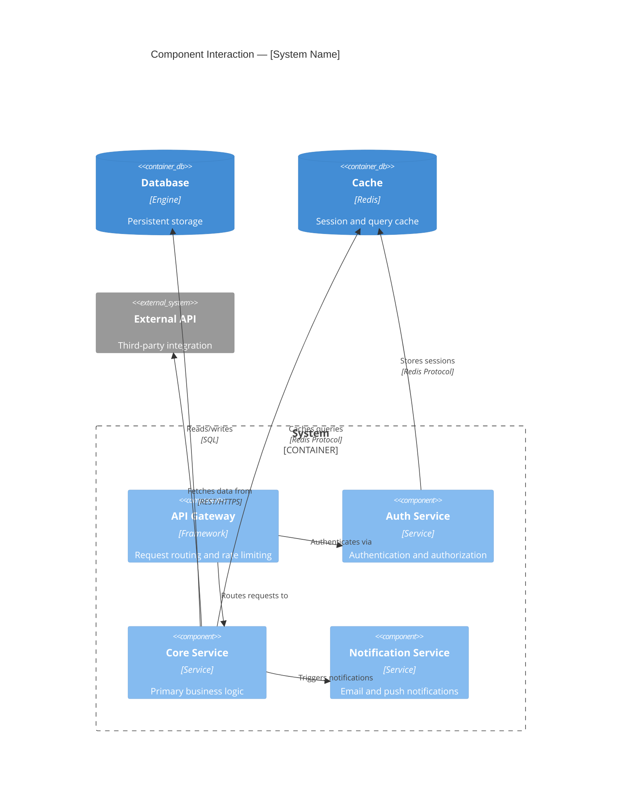
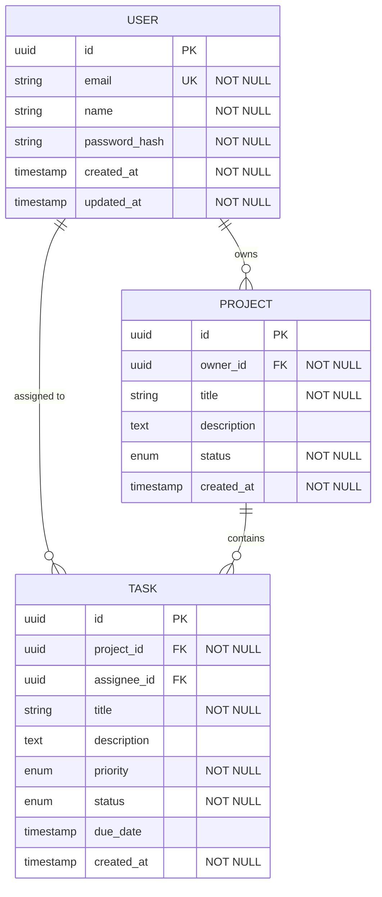

# Architecture Document

> **Phase:** 3 -- Solutioning
> **Agent:** The Architect
> **Status:** Draft
> **Created:** [DATE]
> **Approval date:** [DATE or "Pending"]
> **Approved by:** [Human's name or "Pending"]
> **Upstream References:**
> - [specs/challenger-brief.md](challenger-brief.md)
> - [specs/product-brief.md](product-brief.md)
> - [specs/prd.md](prd.md)

---

## Technical Overview

[3-5 sentence summary of the system being built, the primary technical approach, and the key architectural characteristics (e.g., monolith vs. microservices, server-rendered vs. SPA, sync vs. async). This should give a developer joining the project enough context to understand the high-level picture.]

---

## Existing System Context (Brownfield Only)

> **Instruction:** Include this section only if `project.type` is `brownfield`. Remove it entirely for greenfield projects.

**Source:** [specs/codebase-context.md](codebase-context.md)

### Current Architecture Summary

[2-3 sentence summary of the existing system's architecture as documented by the Scout agent. Reference the C4 diagrams in the codebase context.]

### Constraints from Existing System

| Constraint | Rationale | Impact on New Design |
|------------|-----------|---------------------|
| [e.g., Must maintain PostgreSQL 14] | [Why this can't change] | [How this shapes the new architecture] |
| [e.g., Existing REST API contracts] | [External consumers depend on them] | [Must maintain backward compatibility] |

### Migration Strategy

[Brief description of how the new architecture will coexist with or transition from the existing system. Reference any relevant ADRs.]

---

## Technology Stack

| Layer | Choice | Version | Justification | Alternatives Considered |
|-------|--------|---------|---------------|------------------------|
| **Language** | [e.g., TypeScript] | [e.g., 5.x] | [Why this fits the requirements] | [What else was evaluated and why rejected] |
| **Runtime** | [e.g., Node.js] | [e.g., 20 LTS] | | |
| **Framework** | [e.g., Next.js] | [e.g., 14.x] | | |
| **Database** | [e.g., PostgreSQL] | [e.g., 16] | | |
| **ORM / Query** | [e.g., Prisma] | | | |
| **Authentication** | [e.g., NextAuth.js] | | | |
| **Testing** | [e.g., Vitest + Playwright] | | | |
| **Linting** | [e.g., ESLint + Prettier] | | | |
| **Hosting** | [e.g., Vercel] | | | |
| **CI/CD** | [e.g., GitHub Actions] | | | |

[Add or remove rows as appropriate for the project. Not every project needs every layer.]

---

## System Components

### Component: [Name]

| Attribute | Detail |
|-----------|--------|
| **Responsibility** | [What this component does, 2-3 sentences] |
| **Depends On** | [Other components this one calls or consumes from] |
| **Exposes** | [Interfaces: API endpoints, events, exported functions] |
| **Key Stories** | [PRD story IDs this component implements] |
| **Key Files** | [Primary file paths for this component] |

### Component: [Name]

[Repeat for each component]

---

## Component Interaction Diagram



[Replace with the actual component interaction diagram from Step 3. Use `C4Component` for Mermaid C4 syntax if `diagram_format` is `mermaid`, or provide an ASCII/text-based representation otherwise.]

---

## Data Model

### Entity: [Name]

**Description:** [What this entity represents in the domain]

| Field | Type | Constraints | Default | Description |
|-------|------|-------------|---------|-------------|
| `id` | UUID / SERIAL / etc. | PK | auto-generated | Unique identifier |
| `[field_name]` | [type] | [NOT NULL, UNIQUE, FK -> Table.field, etc.] | [default or none] | [What this field stores] |
| `created_at` | TIMESTAMP | NOT NULL | NOW() | Record creation time |
| `updated_at` | TIMESTAMP | NOT NULL | NOW() | Last modification time |

**Indexes:**
- `idx_[entity]_[field]` on `[field]` -- [justification, e.g., "Supports lookup by email for authentication"]

### Entity: [Name]

[Repeat for each entity]

---

### Entity Relationship Diagram



[Replace with actual ERD. Include field definitions with types, constraints, and keys for each entity. Use Mermaid's `erDiagram` with field blocks for detailed models.]

### Relationship Details

| Relationship | Type | Implementation | Cascade on Delete |
|-------------|------|----------------|-------------------|
| [Entity A] to [Entity B] | One-to-Many | FK `entity_a_id` on Entity B | [CASCADE / SET NULL / RESTRICT] |
| | | | |

---

## API Contracts

### [Resource / Endpoint Group Name]

#### `[METHOD]` `[PATH]`

| Attribute | Detail |
|-----------|--------|
| **Description** | [What this endpoint does] |
| **Auth** | Required / Public / Role: [specific role] |
| **Rate Limit** | [If applicable, e.g., "60 req/min per user"] |
| **Story Reference** | [PRD story ID] |

**Request:**

```
[Method] [Path]
Content-Type: application/json
Authorization: Bearer <token>

{
  "field": "type -- description",
  "field": "type -- description"
}
```

**Response (Success):**

```
HTTP [status code]
Content-Type: application/json

{
  "field": "type -- description",
  "field": "type -- description"
}
```

**Response (Error):**

| Status | Code | Message | When |
|--------|------|---------|------|
| 400 | `VALIDATION_ERROR` | [Detail] | [When this error occurs] |
| 401 | `UNAUTHORIZED` | [Detail] | [When this error occurs] |
| 404 | `NOT_FOUND` | [Detail] | [When this error occurs] |
| 500 | `INTERNAL_ERROR` | [Detail] | [When this error occurs] |

**Error response shape:**
```json
{
  "error": {
    "code": "ERROR_CODE",
    "message": "Human-readable description",
    "details": {}
  }
}
```

---

[Repeat for each endpoint group and endpoint.]

---

## Event Schemas (If Applicable)

### Event: [Name]

| Attribute | Detail |
|-----------|--------|
| **Producer** | [Which component emits this event] |
| **Consumers** | [Which components listen for it] |
| **Delivery** | At-most-once / At-least-once / Exactly-once |

**Payload:**
```json
{
  "event_type": "[name]",
  "timestamp": "ISO-8601",
  "data": {
    "field": "type -- description"
  }
}
```

---

## Infrastructure and Deployment

### Deployment Strategy

[How the application is deployed: static hosting, containers, serverless, traditional server, PaaS. Include specific service names where applicable.]

### Environment Strategy

| Environment | Purpose | URL Pattern | Data | Notes |
|-------------|---------|-------------|------|-------|
| Local | Development | `localhost:[port]` | Seed data / local DB | |
| Staging | Pre-production testing | [URL or pattern] | [Copy of production / synthetic] | |
| Production | Live users | [URL or pattern] | Real data | |

### CI/CD Pipeline

```
Push to branch
  -> Lint
  -> Type check (if applicable)
  -> Unit tests
  -> Integration tests
  -> Build
  -> [Staging deploy on main branch]
  -> [Production deploy on release tag / manual trigger]
```

[Customise the pipeline to match the project's needs.]

### Environment Variables

| Variable | Description | Required | Example | Secret? |
|----------|-------------|----------|---------|---------|
| `DATABASE_URL` | [Database connection string] | Yes | `postgresql://...` | Yes |
| `[VAR_NAME]` | [Description] | Yes / No | [Example value] | Yes / No |

> All required variables should be listed in `.env.example` with placeholder values. Actual secrets must never be committed to the repository.

### Scaling Considerations

[How the system handles increased load. Only include this section if the NFRs specify throughput or concurrency targets. For simple applications, a single sentence like "The application runs as a single instance; scaling is not a concern for the MVP" is sufficient.]

---

## Architecture Decision Records

| ADR | Title | Status | File |
|-----|-------|--------|------|
| ADR-001 | [Decision title] | Accepted | [specs/decisions/001-short-title.md](decisions/001-short-title.md) |
| ADR-002 | [Decision title] | Accepted | [specs/decisions/002-short-title.md](decisions/002-short-title.md) |

[List all ADRs. Full content lives in individual files in specs/decisions/.]

---

## Project Structure

```
[project-root]/
|-- [directory structure as defined by the chosen framework and project needs]
|-- src/
|   |-- [organised by component, feature, or layer as appropriate]
|-- tests/
|   |-- unit/
|   |-- integration/
|-- .env.example
|-- [config files: tsconfig.json, package.json, etc.]
```

[Populate with the actual planned directory structure. Follow the conventions of the chosen framework.]

---

## Insights Reference

**Companion Document:** [specs/insights/architecture-insights.md](insights/architecture-insights.md)

This artifact was informed by ongoing insights captured during Solutioning. Key insights that shaped this document:

1. **[Brief insight title]** - [One sentence summary]
2. **[Brief insight title]** - [One sentence summary]
3. **[Brief insight title]** - [One sentence summary]

See the insights document for complete decision rationale, alternatives considered, and questions explored.

---

## Security Architecture

### Trust Boundaries

```
[Diagram or description of trust boundaries in the system]
[Client] --HTTPS--> [API Gateway] --Internal--> [Services] --Encrypted--> [Database]
         ^                        ^                         ^
    Trust Boundary 1         Trust Boundary 2          Trust Boundary 3
```

### Data Protection

| Data Asset | Sensitivity | At Rest | In Transit | Access Control |
|-----------|-------------|---------|-----------|---------------|
| [e.g., User PII] | Critical | [Encryption method] | TLS 1.3 | [RBAC / ABAC] |
| [e.g., Session tokens] | High | [Storage method] | TLS 1.3 | [HttpOnly cookies] |

### Authentication and Authorisation

| Concern | Approach | Implementation |
|---------|----------|---------------|
| User authentication | [e.g., OAuth 2.0 / JWT / Session] | [Component responsible] |
| Service-to-service auth | [e.g., mTLS / API keys / IAM] | [Component responsible] |
| Authorisation model | [e.g., RBAC / ABAC / ACL] | [Component responsible] |

### OWASP Top 10 Considerations

| Risk | Mitigation in Architecture | Component |
|------|---------------------------|-----------|
| A01: Broken Access Control | [e.g., Middleware auth checks on all routes] | [Component] |
| A02: Cryptographic Failures | [e.g., AES-256 at rest, TLS in transit] | [Component] |
| A03: Injection | [e.g., Parameterised queries via ORM] | [Component] |

> **Note:** For a comprehensive security review, invoke the Security Architect agent (`/jumpstart.security`) after Phase 3 approval. This section captures security decisions made during architecture design; the Security Review provides a full threat model and OWASP audit.

---

## Directory AGENTS.md Plan (Greenfield Only)

> **Instruction:** Include this section only if `project.type` is `greenfield`. Remove it entirely for brownfield projects. The Developer agent will create these files during scaffolding and maintain them during task execution. Use the template from `.jumpstart/templates/agents-md.md`.

| Directory | Purpose | Key Exports | Notes |
|-----------|---------|-------------|-------|
| `src/` | Application root | — | Top-level module documentation |
| [e.g., `src/api/`] | [API endpoint handlers] | [Routes, middleware] | |
| [e.g., `src/models/`] | [Data models and schemas] | [Entity types, validators] | |
| [e.g., `src/services/`] | [Business logic layer] | [Service functions] | |

[Add rows for each directory that should receive an AGENTS.md file. The depth is governed by `agents.developer.agents_md_depth` in config.yaml: `top-level` (src/ only), `module` (src/[module]/), or `deep` (all significant directories).]

---

## Cross-Reference Links

| This Document | Links To | Section |
|---|---|---|
| Technology Stack | [Research](../research.md) | Library Evaluation |
| Components | [PRD](../prd.md) | User Stories |
| Data Model | [PRD](../prd.md) | Data Entities |
| API Contracts | [Implementation Plan](../implementation-plan.md) | Task Mapping |
| NFRs Addressed | [Constraint Map](../constraint-map.md) | NFR Traceability |
| ADRs | [specs/decisions/](../decisions/) | Architecture Decisions |

> **Bidirectional Requirement:** Each linked document MUST link back to this Architecture Document. Validate with `bin/lib/crossref.js`.

---

## Phase Gate Approval

- [ ] Human has reviewed this Architecture Document
- [ ] Every technology choice has a stated justification
- [ ] Component responsibilities are clearly defined
- [ ] Data model covers all entities implied by PRD stories
- [ ] API contracts cover all endpoints implied by PRD stories
- [ ] ADRs exist for all significant technical decisions
- [ ] Project structure is defined
- [ ] Environment variables are documented
- [ ] Human has explicitly approved this document for Phase 4 handoff

**Approved by:** [Human's name or "Pending"]
**Approval date:** [Date or "Pending"]
**Status:** Draft

---

## Linked Data

```json-ld
{
  "@context": { "js": "https://jumpstart.dev/schema/" },
  "@type": "js:SpecArtifact",
  "@id": "js:architecture",
  "js:phase": 3,
  "js:agent": "Architect",
  "js:status": "[STATUS]",
  "js:version": "[VERSION]",
  "js:upstream": [
    { "@id": "js:prd" },
    { "@id": "js:product-brief" },
    { "@id": "js:challenger-brief" }
  ],
  "js:downstream": [
    { "@id": "js:implementation-plan" }
  ],
  "js:traces": []
}
```
