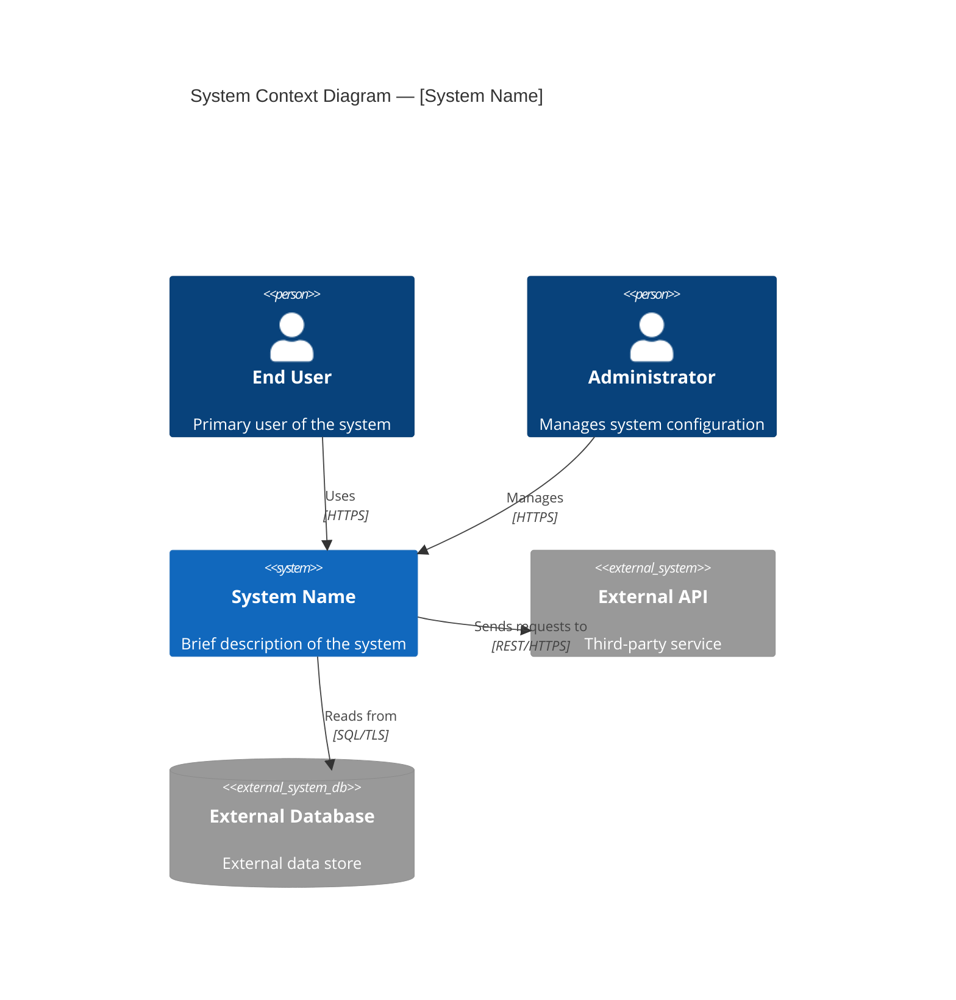
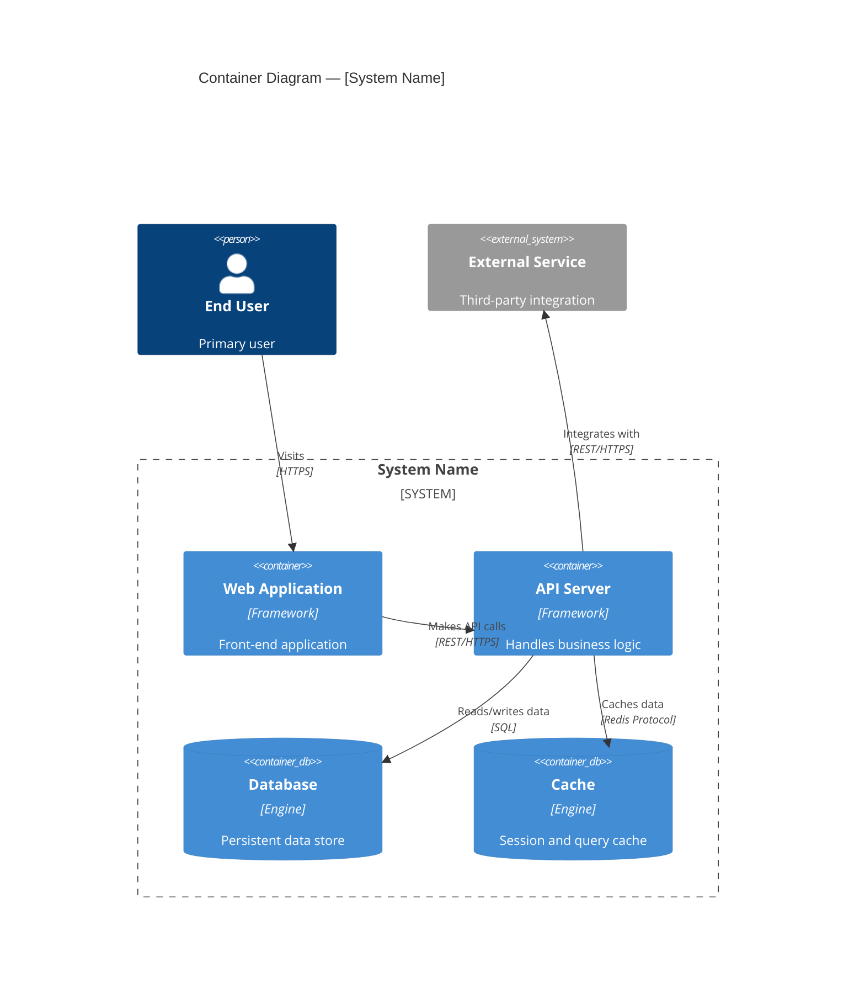
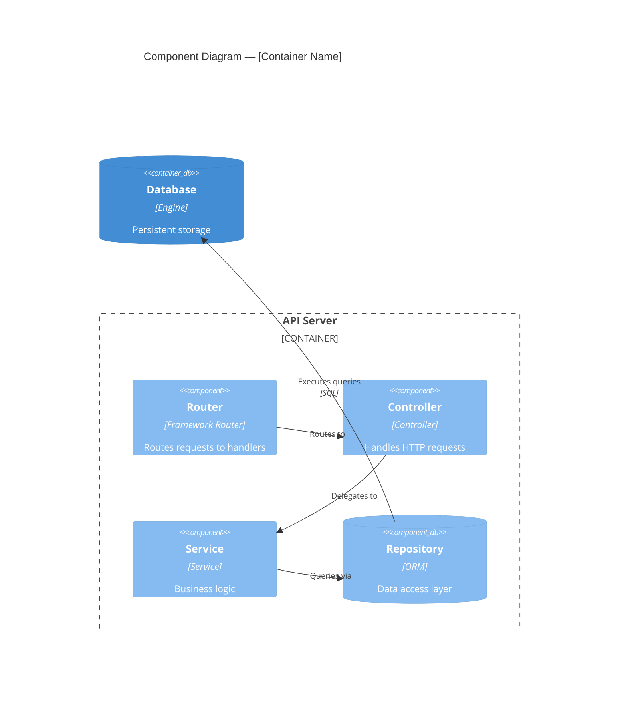
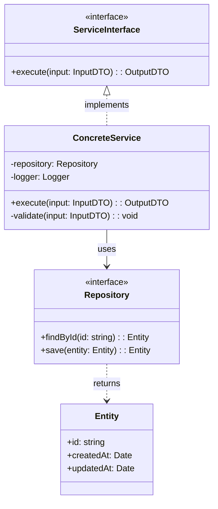

# Codebase Context

> **Phase:** Pre-0 -- Reconnaissance
> **Agent:** The Scout
> **Status:** Draft
> **Created:** [DATE]
> **Approval date:** [DATE or "Pending"]
> **Approved by:** [Human's name or "Pending"]

---

## Project Overview

| Attribute | Detail |
|-----------|--------|
| **Project Name** | [Name from config or repository] |
| **Primary Language(s)** | [e.g., TypeScript, Python, Go] |
| **Framework(s)** | [e.g., Express, Django, React] |
| **Build System** | [e.g., npm scripts, Makefile, Gradle] |
| **Package Manager(s)** | [e.g., npm, pip, cargo] |
| **Runtime** | [e.g., Node.js 20, Python 3.12, Go 1.22] |
| **Repository Age** | [Approximate, from git history if available] |
| **Approximate Size** | [Number of source files, lines of code if measurable] |

---

## Repository Structure

> **Note:** This structure reflects the *original* codebase only. Files and directories created by the JumpStart installation process (`.jumpstart/`, `specs/`, `AGENTS.md`, `CLAUDE.md`, `.cursorrules`, and Copilot integration files under `.github/`) are excluded. See `agents.scout.exclude_jumpstart_paths` in config for the full exclusion list.

```
[project-root]/
|-- [annotated directory tree]
|-- [each directory with a brief purpose description]
```

### Directory Purposes

| Directory | Purpose | Language(s) | Notable Files |
|-----------|---------|-------------|---------------|
| `[dir]` | [What this directory contains and its role] | [Language] | [Key files] |
| | | | |

---

## Technology Stack

| Category | Technology | Version | Role | Notes |
|----------|-----------|---------|------|-------|
| **Language** | [e.g., TypeScript] | [e.g., 5.x] | Primary application language | |
| **Runtime** | [e.g., Node.js] | [e.g., 20 LTS] | Server runtime | |
| **Framework** | [e.g., Express] | [e.g., 4.18] | HTTP server framework | |
| **Database** | [e.g., PostgreSQL] | [e.g., 16] | Primary data store | |
| **ORM** | [e.g., Prisma] | [e.g., 5.x] | Database access layer | |
| **Testing** | [e.g., Jest] | [e.g., 29.x] | Test framework | |
| **Linting** | [e.g., ESLint] | | Code quality | |
| **CI/CD** | [e.g., GitHub Actions] | | Continuous integration | |

[Add or remove rows as appropriate.]

---

## Dependencies

### Production Dependencies

| Package | Version | Category | Role |
|---------|---------|----------|------|
| [package-name] | [version] | Core / Database / Auth / UI / Utility | [What it does in this project] |
| | | | |

### Development Dependencies

| Package | Version | Category | Role |
|---------|---------|----------|------|
| [package-name] | [version] | Testing / Build / Linting / Tooling | [What it does] |
| | | | |

### Dependency Observations

[Notes about dependency health, outdated packages, version pinning strategies, or notable gaps.]

---

## External Integrations

| System / Service | Type | Protocol | Purpose | Configuration |
|-----------------|------|----------|---------|---------------|
| [e.g., Stripe API] | Third-party API | REST/HTTPS | Payment processing | `STRIPE_API_KEY` env var |
| [e.g., PostgreSQL] | Database | TCP/SQL | Primary data store | `DATABASE_URL` env var |
| [e.g., Redis] | Cache | TCP | Session/cache store | `REDIS_URL` env var |
| | | | | |

---

## C4 Architecture Diagrams

### System Context (Level 1)



[Description of what this diagram shows — the system boundary and external actors.]

---

### Container Diagram (Level 2)



[Description of the major deployable containers within the system.]

---

### Component Diagram (Level 3) — If Configured



[Description of internal components within the primary container.]

---

### Code Diagram (Level 4) — If Configured



[Include only if `c4_levels` includes `code`. Focus on the most critical or complex modules. Map actual classes and interfaces from the codebase.]

---

## Code Patterns and Conventions

### File Organization

| Pattern | Convention | Example |
|---------|-----------|---------|
| **File naming** | [kebab-case / camelCase / PascalCase / snake_case] | [e.g., `user-service.ts`] |
| **Directory structure** | [Feature-based / Layer-based / Hybrid] | [e.g., `src/features/auth/`] |
| **Test location** | [Co-located / Separate tree / Both] | [e.g., `__tests__/` next to source] |
| **Config files** | [Root / Dedicated config dir] | [e.g., `.env`, `config/`] |

### Coding Patterns

| Pattern | Approach | Notes |
|---------|----------|-------|
| **Error handling** | [Exceptions / Result types / Error codes / Error-first callbacks] | |
| **Async model** | [async/await / Promises / Callbacks / Goroutines] | |
| **Dependency injection** | [Constructor / Framework DI / Module imports / None] | |
| **Logging** | [Library name and approach, e.g., "Winston, structured JSON"] | |
| **Input validation** | [Library or approach, e.g., "Joi schemas at controller layer"] | |
| **State management** | [Approach if frontend, e.g., "Redux Toolkit"] | |

### Testing Patterns

| Aspect | Convention |
|--------|-----------|
| **Test framework** | [e.g., Jest, pytest, Go testing] |
| **Test naming** | [e.g., `describe/it`, `test_function_name`, `TestFunctionName`] |
| **Mocking approach** | [e.g., jest.mock, unittest.mock, testify/mock] |
| **Test data** | [Fixtures / Factories / Inline / Seed files] |
| **Coverage** | [Approximate coverage level if measurable] |

---

## Existing Documentation

| Document | Location | Status | Notes |
|----------|----------|--------|-------|
| README | [path] | [Current / Outdated / Minimal] | [Brief assessment] |
| API docs | [path or URL] | [Current / Outdated / Missing] | |
| Architecture docs | [path] | [Current / Outdated / Missing] | |
| Contributing guide | [path] | [Exists / Missing] | |
| AGENTS.md / AI instructions | [path] | [Exists / Missing] | |

---

## Technical Debt and Observations

> **Note:** These are observations, not recommendations. The Scout documents what it sees without prescribing changes.

### Structural Observations

- [Observation about code organization, module boundaries, or file structure]
- [e.g., "The `utils/` directory contains 47 files with varied purposes, suggesting it may benefit from sub-categorization"]

### Code Quality Observations

- [Observation about patterns, consistency, or notable code characteristics]
- [e.g., "Error handling is inconsistent: controllers use try/catch, services use error callbacks"]

### Test Coverage Observations

- [Observation about which areas are well-tested vs. under-tested]
- [e.g., "Unit tests exist for all service modules; no integration or e2e tests found"]

### Security Observations

- [Observation about security-relevant patterns]
- [e.g., "Authentication middleware is applied per-route rather than globally"]

### TODO/FIXME/HACK Comments

| File | Line | Comment | Category |
|------|------|---------|----------|
| [path] | [line] | [The comment text] | TODO / FIXME / HACK |
| | | | |

[Include only notable or high-impact comments, not an exhaustive list.]

---

## Key Files Reference

| File | Purpose | Importance |
|------|---------|------------|
| [path] | [What this file does — entry point, config, core logic, etc.] | Critical / High / Medium |
| | | |

---

## Insights Reference

**Companion Document:** [specs/insights/codebase-context-insights.md](insights/codebase-context-insights.md)

This artifact was informed by ongoing insights captured during reconnaissance. Key insights:

1. **[Brief insight title]** - [One sentence summary]
2. **[Brief insight title]** - [One sentence summary]
3. **[Brief insight title]** - [One sentence summary]

See the insights document for complete observation rationale, ambiguities encountered, and patterns discovered.

---

## Phase Gate Approval

- [ ] Repository structure has been mapped and annotated
- [ ] Dependencies have been cataloged with categories and versions
- [ ] C4 diagrams have been generated at configured levels
- [ ] Code patterns and conventions have been documented
- [ ] The human has reviewed and approved this document

**Approved by:** [Human's name or "Pending"]
**Approval date:** [Date or "Pending"]
**Status:** Draft
