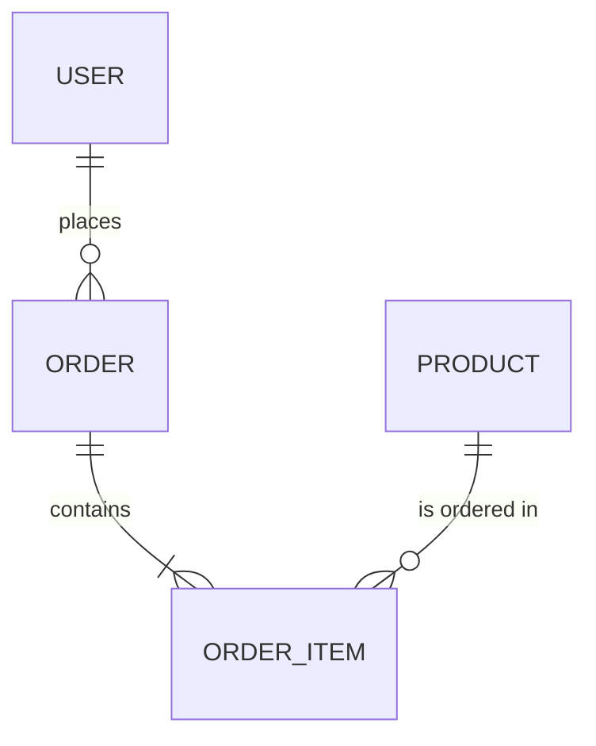

# Data Model

> **Phase:** 3 — Solutioning
> **Agent:** The Architect
> **Status:** Draft
> **Created:** [DATE]
> **Upstream References:**
> - [specs/prd.md](prd.md)
> - [specs/architecture.md](architecture.md)

---

## Overview

[Brief description of the data model approach: relational, document, graph, hybrid. Explain naming conventions and key design decisions.]

---

## Entity-Relationship Diagram

---

## Entities

### Entity: [Name]

| Attribute | Type | Constraints | Description |
|-----------|------|-------------|-------------|
| `id` | UUID | PK, NOT NULL | Unique identifier |
| `created_at` | TIMESTAMP | NOT NULL, DEFAULT NOW() | Creation timestamp |
| `updated_at` | TIMESTAMP | NOT NULL | Last modification |
| [field] | [type] | [constraints] | [description] |

**Indexes:**
- `idx_[entity]_[field]` on (`[field]`) — [justification]

**Business Rules:**
- [Rule 1]
- [Rule 2]

---

### Entity: [Name]

[Repeat for each entity]

---

## Relationships

| From | To | Type | FK Column | On Delete | On Update | Description |
|------|----|------|-----------|-----------|-----------|-------------|
| [Entity A] | [Entity B] | 1:N | `[fk_column]` | CASCADE | CASCADE | [description] |

---

## Enumerations

### [Enum Name]

| Value | Description |
|-------|-------------|
| `value_1` | [description] |
| `value_2` | [description] |

---

## Migration Strategy

[Describe how the schema will be migrated: tool (Prisma Migrate, Flyway, Alembic, etc.), versioning approach, rollback plan.]

---

## Validation Rules

| Entity | Field | Rule | Error Message |
|--------|-------|------|---------------|
| [Entity] | [field] | [validation logic] | [user-facing message] |

---

## Seed Data

[Describe any initial data that must be present for the system to function: admin users, lookup tables, default configurations.]

---

## Cross-References

| Data Model Entity | PRD Story | Architecture Component |
|-------------------|-----------|----------------------|
| [Entity] | [E01-S01] | [Component Name] |

---

## Phase Gate Approval

- [ ] All PRD entities are represented
- [ ] Relationships match the architecture component diagram
- [ ] Indexes are justified by query patterns
- [ ] Migration strategy is defined
- [ ] Validation rules cover all business constraints

**Approved by:** Pending
**Approval date:** Pending
