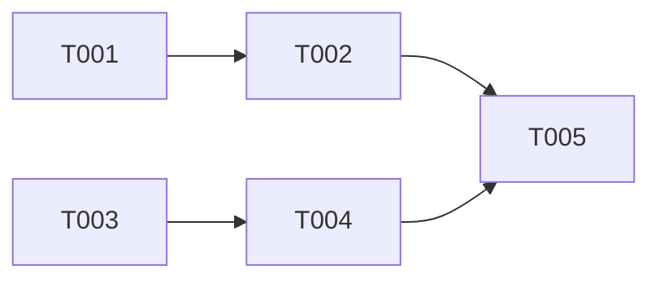

# Sprint Planning: {{Sprint Name}}

> **Sprint Initialisation and Task Assignment**

## Sprint Metadata

| Field | Value |
|---|---|
| Sprint Name | {{Sprint N}} |
| Start Date | {{Date}} |
| End Date | {{Date}} |
| Duration | {{N}} days |
| Sprint Goal | {{One sentence describing what success looks like}} |
| Velocity Target | {{N}} tasks (based on historical velocity or team estimate) |

---

## 1. Sprint Backlog

### Selected Stories

| Story ID | Title | Priority | Points | Assignee | Status |
|---|---|---|---|---|---|
| {{E1-S1}} | {{Story title}} | Must Have | {{N}} | {{Assignee}} | Not Started |

### Selected Tasks

| Task ID | Story | Description | Estimate | Assignee | Dependencies | Status |
|---|---|---|---|---|---|---|
| {{T001}} | {{E1-S1}} | {{Task description}} | {{hours}} | {{Assignee}} | None | Not Started |

---

## 2. Sprint Capacity

| Resource | Available Hours | Allocated Hours | Buffer |
|---|---|---|---|
| {{Developer}} | {{N}} | {{N}} | {{N}} |
| **Total** | **{{N}}** | **{{N}}** | **{{N}}** |

---

## 3. Definition of Done

All tasks must meet these criteria before being marked complete:

- [ ] Code is written and follows architecture guidelines
- [ ] Unit tests are written and passing
- [ ] Integration tests pass (where applicable)
- [ ] Code review completed
- [ ] Documentation updated
- [ ] No new linting errors introduced
- [ ] Acceptance criteria verified

---

## 4. Dependency Map



### Critical Path

| Step | Task | Duration | Cumulative |
|---|---|---|---|
| 1 | {{T001}} | {{N}} hours | {{N}} hours |
| 2 | {{T002}} (blocked by T001) | {{N}} hours | {{N}} hours |

---

## 5. Risks and Mitigations

| Risk | Probability | Impact | Mitigation | Owner |
|---|---|---|---|---|
| {{Risk}} | High / Medium / Low | High / Medium / Low | {{Mitigation plan}} | {{Owner}} |

---

## 6. Ceremonies

| Ceremony | Day | Time | Duration | Format |
|---|---|---|---|---|
| Sprint Planning | Day 1 | {{Time}} | 1 hour | Synchronous |
| Daily Standup | Daily | {{Time}} | 15 min | Async / Sync |
| Sprint Review | Last Day | {{Time}} | 30 min | Synchronous |
| Retrospective | Last Day | {{Time}} | 30 min | Async with `/jumpstart.retro` |

---

## 7. Sprint Board Initial State

### Not Started
- {{T001}}: {{Description}}
- {{T002}}: {{Description}}

### In Progress
_(empty at sprint start)_

### Done
_(empty at sprint start)_

### Blocked
_(empty at sprint start)_

---

## Linked Data

```json-ld
{
  "@context": { "js": "https://jumpstart.dev/schema/" },
  "@type": "js:SpecArtifact",
  "@id": "js:sprint-planning",
  "js:phase": "advisory",
  "js:agent": "ScrumMaster",
  "js:status": "[STATUS]",
  "js:version": "[VERSION]",
  "js:upstream": [
    { "@id": "js:prd" },
    { "@id": "js:implementation-plan" }
  ],
  "js:downstream": [],
  "js:traces": []
}
```
