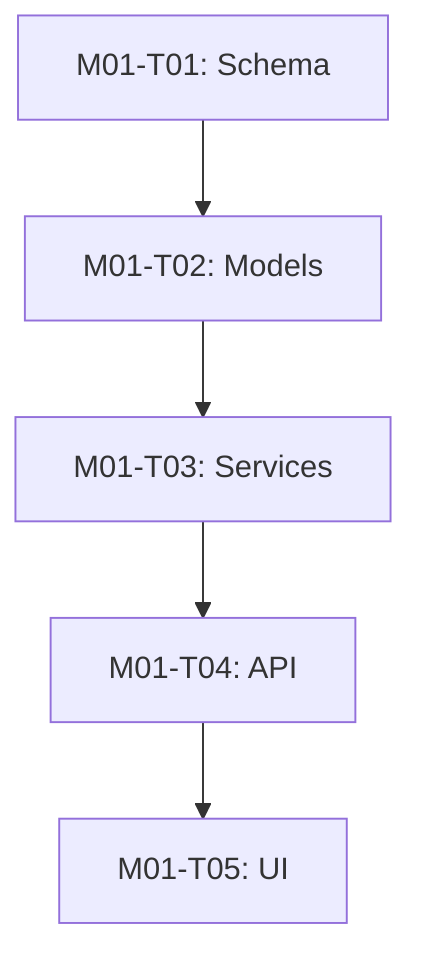

# Task Dependency Audit

> **Generated:** [DATE]
> **Tool:** `bin/lib/graph.js`
> **Source:** `specs/implementation-plan.md`

---

## Summary

| Metric | Value |
|--------|-------|
| **Total tasks** | [N] |
| **Dependency edges** | [N] |
| **Critical path length** | [N tasks] |
| **Dependency inversions** | [N] |
| **Circular dependencies** | [N] |

---

## Recommended Build Order

Tasks sorted by topological order (dependencies resolved first).

| Order | Task ID | Description | Depends On | Layer |
|-------|---------|-------------|------------|-------|
| 1 | [M01-T01] | [Database schema setup] | — | Data |
| 2 | [M01-T02] | [Core models] | M01-T01 | Model |
| 3 | [M01-T03] | [Service layer] | M01-T02 | Service |
| 4 | [M01-T04] | [API endpoints] | M01-T03 | API |
| 5 | [M01-T05] | [UI components] | M01-T04 | UI |

---

## Dependency Graph



---

## Dependency Inversions

Tasks that build higher layers before their dependencies are ready.

| Task | Layer | Depends On | Dependency Layer | Issue |
|------|-------|------------|-----------------|-------|
| [M02-T01] | UI | [M02-T03] | Service | UI task scheduled before service task |

---

## Circular Dependencies

Pairs or chains of tasks that form cycles (MUST be resolved).

| Cycle | Tasks | Resolution |
|-------|-------|------------|
| [1] | M01-T03 → M01-T05 → M01-T03 | [Break cycle by extracting shared interface] |

---

## Critical Path

The longest chain of dependent tasks — determines minimum project duration.

```
[M01-T01] → [M01-T02] → [M01-T03] → [M01-T04] → [M01-T05]
Total: [N] tasks, estimated [N] story points
```

---

## Parallelizable Groups

Tasks with no mutual dependencies that can be worked on concurrently.

| Group | Tasks | Notes |
|-------|-------|-------|
| A | M01-T02, M02-T01 | Independent modules |
| B | M01-T04, M02-T03 | Different components |

---

## Layer Distribution

| Layer | Tasks | % |
|-------|-------|---|
| Data / Schema | [N] | [%] |
| Model | [N] | [%] |
| Service | [N] | [%] |
| API | [N] | [%] |
| UI | [N] | [%] |
| Infrastructure | [N] | [%] |
