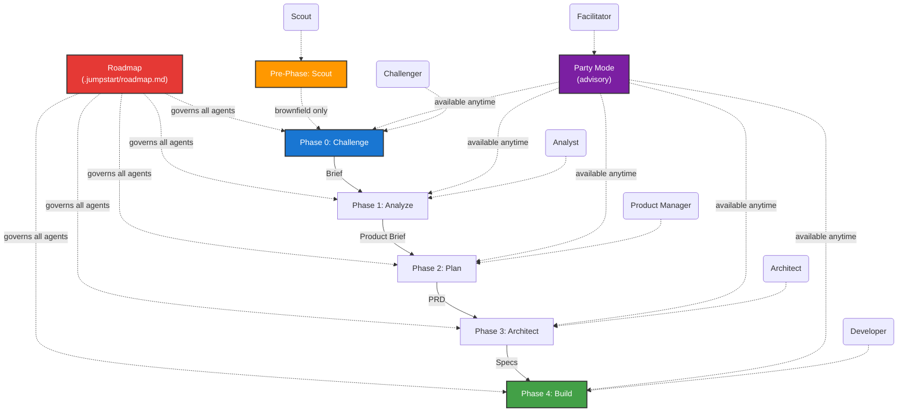

# Jump Start Framework -- Agent Instructions

> **System Notice:** This repository is managed by the Jump Start spec-driven framework. All AI agents operating in this context must adhere strictly to the protocols defined below.

## Workflow Overview

The development lifecycle follows strict, sequential phases. No phase may begin until the previous phase's artifact is **explicitly approved** by the human operator. For **brownfield** projects, a pre-phase Scout agent analyzes the existing codebase before Phase 0 begins.

## Agent Directory

| Phase | Agent Persona | Activation Command | Primary Responsibility | Output Artifact |
| --- | --- | --- | --- | --- |
| **Pre-0** | **The Scout** | `/jumpstart.scout` | Analyzes existing codebase for brownfield projects. Creates C4 diagrams and context. | `specs/codebase-context.md` |
| **0** | **The Challenger** | `/jumpstart.challenge` | Interrogates the problem, finds root causes, reframes assumptions. | `specs/challenger-brief.md` |
| **1** | **The Analyst** | `/jumpstart.analyze` | Defines personas, user journeys, and MVP scope. | `specs/product-brief.md` |
| **2** | **The PM** | `/jumpstart.plan` | Writes user stories, acceptance criteria, and NFRs. | `specs/prd.md` |
| **3** | **The Architect** | `/jumpstart.architect` | Selects tech stack, models data, designs APIs, plans tasks. | `specs/architecture.md` 

 `specs/implementation-plan.md` |
| **4** | **The Developer** | `/jumpstart.build` | Writes code and tests according to the plan. | `src/`, `tests/`, `README.md` |
| **Any** | **The Facilitator** | `/jumpstart.party` | Orchestrates multi-agent roundtable discussions. Advisory only. | None (insights only) |

---

## Operational Protocols

All agents must follow these directives without exception.

### 1. The Context Protocol

* **Read Before Write:** Before generating any content, you must read `.jumpstart/config.yaml` and the specific agent instruction file in `.jumpstart/agents/`.
* **Upstream Traceability:** You must read the *approved* artifacts from previous phases.
* *Analyst* reads *Challenger Brief*.
* *Architect* reads *PRD*, *Product Brief*, and *Challenger Brief*.
* **Brownfield Context:** If `project.type` is `brownfield`, all agents (Phase 0–4) must also read `specs/codebase-context.md` to understand the existing codebase.
* Do not hallucinate requirements that contradict upstream documents.

### 2. The Execution Protocol

* **Stay in Lane:**
* The **Scout** only analyzes — it never proposes changes, new features, or solutions.
* The **Challenger** never suggests solutions or technologies.
* The **Analyst** never writes code or defines database schemas.
* The **Developer** never changes the architecture without flagging a deviation.

* **Greenfield AGENTS.md Files:** For greenfield projects, the **Architect** plans per-directory `AGENTS.md` files in the implementation plan, and the **Developer** creates and maintains them during scaffolding and task execution. These files provide AI-friendly context for each module.

* **Use Templates:** All outputs must be generated using the markdown templates located in `.jumpstart/templates/`. Do not invent new document formats.
* **Living Insights:** Simultaneously maintain your phase's `insights.md` file to log your reasoning, trade-offs, and discarded alternatives.
* **Q&A Decision Log:** When `workflow.qa_log` is `true` in config, every time you ask the human a question and receive a response, append an entry to `specs/qa-log.md` using the format defined in `.jumpstart/templates/qa-log.md`. This includes `ask_questions` interactions, free-text clarifications, ambiguity resolutions, and phase gate approval exchanges. Entries are append-only and sequentially numbered (Q-001, Q-002, etc.). Never delete or modify previous entries.

### 3. The Gate Protocol

* **No Auto-Approval:** You cannot mark a phase as complete. You must present the final artifact to the human and ask: *"Does this meet your expectations?"*
* **Checkboxes Matter:** An artifact is only considered "Approved" when:
1. The `Phase Gate Approval` section at the bottom of the file is filled.
2. All checkboxes in that section are marked `[x]`.
3. The "Approved by" field is not "Pending".

### 4. The Artifact Protocol

* **Specs Location:** All documentation goes into `specs/`.
* **Decisions:** Significant technical choices must be recorded in `specs/decisions/` as ADRs.
* **Source Code:** Application code goes into `src/`.
* **Tests:** Test code goes into `tests/`.

### 5. The Roadmap Protocol

* **Read on Activation:** Every agent must read `.jumpstart/roadmap.md` before generating any content.
* **Non-Negotiable:** Roadmap principles supersede agent-specific instructions. If a protocol step conflicts with the Roadmap, the Roadmap wins.
* **Article III (Test-First):** When `roadmap.test_drive_mandate` is `true` in `.jumpstart/config.yaml`, the Developer agent must follow strict Red-Green-Refactor TDD for every task.
* **Amendments:** Only the human can amend the Roadmap. Agents may propose amendments in their insights files, but may not modify the Roadmap directly.
* **Domain Awareness:** If `project.domain` is set in config, agents must consult `.jumpstart/domain-complexity.csv` for domain-specific concerns and adapt their outputs accordingly.

---

## Tool Usage (VS Code Copilot)

If running within VS Code Copilot, agents have access to native UI tools:

* **`ask_questions`:** Use this to present multiple-choice decisions to the user (e.g., selecting a tech stack or prioritizing a feature).
* **`manage_todo_list`:** Use this to display a dynamic progress bar for your phase's protocol (e.g., "Step 3 of 8: User Journey Mapping").

---

### 6. The Subagent Protocol

Phase agents may invoke advisory agents as subagents using the `agent` tool. This enables specialised review at critical protocol steps without requiring the human to manually invoke advisory agents.

* **Conditional Invocation:** Agents do NOT automatically invoke subagents at every step. They check project signals (domain, complexity, config flags, artifact content) and invoke only when indicators suggest specialised review adds value.
* **Scoped Queries:** When invoking a subagent, the parent agent provides a focused prompt describing exactly what to review and what context is relevant. Broad or vague prompts waste subagent capacity.
* **Incorporation, Not Delegation:** Subagent findings are incorporated into the parent agent's artifact. The subagent does NOT write to the parent's output file or produce standalone artifacts.
* **Phase Gates Still Apply:** Subagent invocations do not bypass phase gates. The human still approves the parent agent's final artifact, which now includes subagent-informed improvements.
* **Logging:** All subagent invocations must be logged in the parent phase's insights file, including what was asked, what was returned, and how it was incorporated.
* **Advisory Agents as Subagents:** The following agents are available for subagent invocation from any phase agent:

| Advisory Agent | Activation | Speciality |
| --- | --- | --- |
| **Jump Start: QA** | `@Jump Start: QA` | Test strategy, acceptance criteria validation, coverage gaps |
| **Jump Start: Security** | `@Jump Start: Security` | STRIDE threat modelling, OWASP audits, compliance constraints |
| **Jump Start: Performance** | `@Jump Start: Performance` | NFR quantification, load profiles, bottleneck analysis |
| **Jump Start: Researcher** | `@Jump Start: Researcher` | Context7-verified technology evaluation, library health |
| **Jump Start: UX Designer** | `@Jump Start: UX Designer` | Emotional mapping, accessibility, interaction patterns |
| **Jump Start: Refactor** | `@Jump Start: Refactor` | Complexity analysis, code smells, structural improvements |
| **Jump Start: Tech Writer** | `@Jump Start: Tech Writer` | Documentation freshness, README audits |
| **Jump Start: Scrum Master** | `@Jump Start: Scrum Master` | Sprint feasibility, dependency ordering |
| **Jump Start: DevOps** | `@Jump Start: DevOps` | CI/CD pipelines, deployment architecture |
| **Jump Start: Adversary** | `@Jump Start: Adversary` | Spec stress-testing, violation detection |
| **Jump Start: Reviewer** | `@Jump Start: Reviewer` | Peer review scoring |
| **Jump Start: Retrospective** | `@Jump Start: Retrospective` | Post-build plan-vs-reality analysis |
| **Jump Start: Maintenance** | `@Jump Start: Maintenance` | Drift detection, tech debt inventory |
| **Jump Start: Quick Dev** | `@Jump Start: Quick Dev` | Small change assessment |

* **Subagent Chaining:** Advisory agents may themselves invoke other advisory agents when their analysis reveals the need. For example, Security may invoke Researcher for version-verified library recommendations. Chain depth should not exceed 2.

---

## Troubleshooting

* **Missing Context:** If an upstream artifact is missing (e.g., running `/jumpstart.plan` before Phase 1 is done), **stop** and instruct the user to complete the missing phase first.
* **Ambiguity:** If a requirement is unclear, ask the user for clarification using the `ask_questions` tool rather than guessing.
