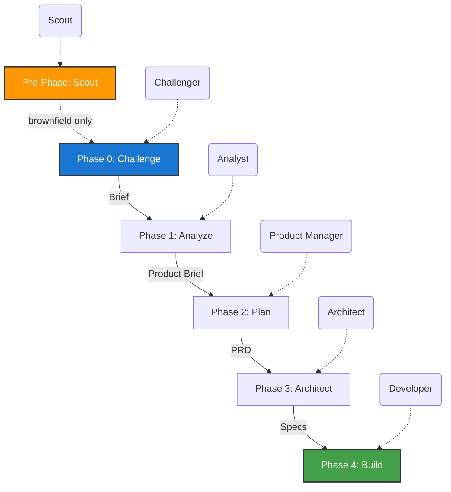

# ⚡ Jump Start


**A spec-driven agentic coding framework that transforms a raw idea into production-ready code through five sequential, AI-governed phases.**

Every artifact lives in your repository, version-controlled, diffable, and transparent.

---

## Table of Contents
- [Quick Start](#quick-start)
- [Onboarding Guide](ONBOARDING.md) 📘
- [How It Works](#how-it-works)
- [Commands](#commands)
- [Advisory Agents](#advisory-agents)
- [CLI Tools](#cli-tools)
- [Quality Gates](#quality-gates)
- [Skills & Modules](#skills--modules)
- [Project Structure](#project-structure)
- [Configuration](#configuration)
- [Living Insights](#living-insights)
- [Greenfield vs. Brownfield](#greenfield-vs-brownfield)
- [Using with AI Assistants](#using-with-ai-assistants)
- [VS Code Chat Features](#vs-code-chat-features)
- [Extending the Framework](#extending-the-framework)
- [Philosophy](#philosophy)

---

## How It Works

Jump Start runs five phases in a strict sequence. Each phase is owned by a specialized AI agent and produces Markdown artifacts that serve as the input for the next phase. A human gate sits between every transition to ensure quality.

For **brownfield** projects (existing codebases), an optional pre-phase Scout agent analyzes the codebase first. For **greenfield** projects (new codebases), the Architect and Developer agents create per-directory `AGENTS.md` files to document the emerging codebase.



**Pre-Phase -- Codebase Reconnaissance (Brownfield Only).** The Scout agent scans the existing codebase, maps the technology stack, generates C4 architecture diagrams, identifies code patterns and technical debt, and produces a codebase context document that informs all subsequent phases.

**Phase 0 -- Problem Discovery.** The Challenger agent interrogates your idea, surfaces hidden assumptions, drills to root causes, and produces a validated problem statement.

**Phase 1 -- Analysis.** The Analyst agent creates user personas, maps current and future-state journeys, and recommends an MVP scope.

**Phase 2 -- Planning.** The PM agent writes a Product Requirements Document with epics, user stories, acceptance criteria, and non-functional requirements.

**Phase 3 -- Solutioning.** The Architect agent selects technologies, designs components and data models, specifies API contracts, and produces an ordered implementation plan.

**Phase 4 -- Implementing.** The Developer agent executes the plan task by task, writing tested code that fulfils the specifications.

---

## Quick Start

> **👋 First time here?** Check out the **[Onboarding Guide](ONBOARDING.md)** for a complete walkthrough including configuration details, agent orchestration, and best practices.

### 1. Install

**Interactive Mode** (recommended):

```bash
npx jumpstart-mode
```

Follow the prompts to set up the framework. You'll be asked for:
- Target directory (default: current directory)
- Project name (optional)
- Project type (greenfield or brownfield — auto-detected based on existing files)
- Whether to include GitHub Copilot integration

**Command-line Mode:**

```bash
# Install into current directory
npx jumpstart-mode

# Install into a specific directory
npx jumpstart-mode ./my-project

# Install with all options
npx jumpstart-mode ./my-project --name "My Project" --copilot

# Install for an existing codebase (brownfield)
npx jumpstart-mode ./existing-app --type brownfield --copilot

# Preview what will be installed
npx jumpstart-mode --dry-run .

# Overwrite existing files
npx jumpstart-mode --force
```

**Global Installation:**

```bash
npm install -g jumpstart-mode
jumpstart-mode ./my-project --name "My Project"
```

**Options:**

- `<directory>` — Target directory (default: current)
- `--name <name>` — Set project name in config
- `--type <type>` — Set project type: `greenfield` or `brownfield` (auto-detected if omitted)
- `--copilot` — Include GitHub Copilot integration files
- `--force` — Overwrite existing files without prompting
- `--dry-run` — Show what would be installed without copying
- `--help` — Display help information

**Alternative: Bash Installer**

For users who prefer shell scripts:

```bash
./install.sh /path/to/your/project --name "My Project"
```

This creates the full directory structure, all agent definitions, templates, and integration files for GitHub Copilot, Claude Code, and Cursor.

### 2. Configure

Edit `.jumpstart/config.yaml` to customise agent behavior, story format, prioritization method, and other settings. The file is self-documenting with inline comments.

### 3. Run

**With GitHub Copilot in VS Code:**

1. Open the project in VS Code
2. Open Copilot Chat
3. **Brownfield projects:** Select **"Jump Start: Scout"** agent first to analyze the existing codebase. After approval, proceed to Phase 0.
4. **All projects:** Click the agent dropdown and select **"Jump Start: Challenger"**
5. Describe your idea or problem when prompted
6. After Phase 0 is approved, select **"Jump Start: Analyst"** and continue through each phase

**With Claude Code:**

```
# Brownfield projects: run Scout first
/jumpstart.scout

# Then start Phase 0
/jumpstart.challenge I want to build a tool that helps remote teams track meeting action items
```

Then continue with `/jumpstart.analyze`, `/jumpstart.plan`, `/jumpstart.architect`, `/jumpstart.build`.

**Check progress any time:** use the `jumpstart-status` prompt (Copilot) or `/jumpstart.status` (Claude Code).

---

## Commands

### Core Phase Commands

| Command | Phase | What It Does |
|---------|-------|-------------|
| `/jumpstart.scout` | Pre-0 | Analyze existing codebase (brownfield only) |
| `/jumpstart.challenge` | 0 | Begin problem discovery |
| `/jumpstart.analyze` | 1 | Generate Product Brief |
| `/jumpstart.plan` | 2 | Generate PRD |
| `/jumpstart.architect` | 3 | Generate Architecture Document and Implementation Plan |
| `/jumpstart.build` | 4 | Execute the implementation plan |

### Advisory & Utility Commands

| Command | Purpose |
|---------|--------|
| `/jumpstart.party` | Multi-agent roundtable discussion (Party Mode) |
| `/jumpstart.status` | Show current workflow state and progress dashboard |
| `/jumpstart.review` | Validate artifacts against templates |
| `/jumpstart.verify` | Verify diagram syntax and structure |
| `/jumpstart.insights` | View living insight logs |
| `/jumpstart.help` | Display command reference |
| `/jumpstart.quick` | Accelerated path for bug fixes and tiny features |
| `/jumpstart.deploy` | Generate CI/CD pipeline and deployment plan |
| `/jumpstart.retro` | Post-build retrospective and lessons learned |

### Specialist Agent Commands

| Command | Agent | Purpose |
|---------|-------|---------|
| `/jumpstart.adversary` | Adversary | Stress-test spec artifacts for gaps and violations |
| `/jumpstart.reviewer` | Peer Reviewer | Score artifacts across quality dimensions |
| `/jumpstart.ux-design` | UX Designer | Emotional response mapping and design consistency |
| `/jumpstart.security` | Security Architect | OWASP audit and trust boundary analysis |
| `/jumpstart.qa` | QA Engineer | Test strategy and release readiness |
| `/jumpstart.performance` | Performance Engineer | Performance budgets and scale analysis |
| `/jumpstart.research` | Researcher | Evidence-based technology evaluation |
| `/jumpstart.docs` | Tech Writer | Documentation accuracy alongside Phase 4 |
| `/jumpstart.sprint` | Scrum Master | Sprint orchestration and blocker detection |
| `/jumpstart.refactor` | Refactor Agent | Post-build structural improvements |
| `/jumpstart.maintenance` | Maintenance Agent | Dependency drift and tech debt detection |

### Quality & Analysis Commands

| Command | Purpose |
|---------|--------|
| `/jumpstart.smell` | Detect spec smells (vague language, scope creep) |
| `/jumpstart.consistency` | Cross-spec consistency analysis |
| `/jumpstart.crossref` | Cross-reference traceability check |
| `/jumpstart.checklist` | Run phase gate checklists |
| `/jumpstart.scan` | Scan for anti-abstraction violations |
| `/jumpstart.revert` | Revert to a previous artifact version |
| `/jumpstart.adr-search` | Search Architecture Decision Records |
| `/jumpstart.sprint-plan` | Generate sprint plan from implementation tasks |

---

## Advisory Agents

Beyond the six core phase agents, Jump Start includes **16 advisory agents** that can be invoked at any time to provide specialist analysis. Advisory agents are non-gating — their outputs inform decisions but do not block phase progression.

| Agent | Command | Specialty |
|-------|---------|---------|
| Adversary | `/jumpstart.adversary` | Stress-tests specs for violations, gaps, and ambiguities |
| Peer Reviewer | `/jumpstart.reviewer` | Scores artifacts across completeness, consistency, clarity, feasibility |
| Facilitator | `/jumpstart.party` | Orchestrates multi-agent roundtable discussions |
| UX Designer | `/jumpstart.ux-design` | Emotional response mapping, information architecture, accessibility |
| Security Architect | `/jumpstart.security` | OWASP audits, trust boundaries, encryption review |
| DevOps Engineer | `/jumpstart.deploy` | CI/CD pipelines, deployment plans, environment management |
| QA Engineer | `/jumpstart.qa` | Test coverage, test strategy, release readiness assessment |
| Performance Engineer | `/jumpstart.performance` | Performance budgets, latency/throughput NFR validation |
| Researcher | `/jumpstart.research` | Evidence-based technology evaluation with Context7 |
| Scrum Master | `/jumpstart.sprint` | Sprint orchestration, task sizing, blocker detection |
| Tech Writer | `/jumpstart.docs` | Documentation accuracy sidecar alongside Phase 4 |
| Refactor Agent | `/jumpstart.refactor` | Post-build structural improvements and complexity reduction |
| Maintenance Agent | `/jumpstart.maintenance` | Dependency drift, spec drift, tech debt detection |
| Retrospective Agent | `/jumpstart.retro` | Post-build learnings capture and process improvements |
| Quick Dev | `/jumpstart.quick` | Accelerated path for bug fixes and tiny features |
| Diagram Verifier | `/jumpstart.verify` | Validates Mermaid diagrams for structural/semantic correctness |

---

## CLI Tools

The `jumpstart-mode` CLI provides 29 subcommands for automated quality checks and project management. Run them from the command line:

```bash
npx jumpstart-mode <subcommand> [options]
```

### Validation & Quality

| Subcommand | Purpose |
|------------|--------|
| `validate` | Validate spec artifacts against JSON schemas |
| `spec-drift` | Detect drift between specs and implementation |
| `smells` | Detect spec smells (vague language, missing constraints) |
| `lint` | Lint spec artifacts for formatting and structure |
| `consistency` | Cross-spec consistency analysis |
| `contracts` | Validate API and data contracts |
| `coverage` | Story-to-task traceability coverage report |
| `handoff-check` | Validate handoff contracts between phases |
| `checklist` | Run phase gate checklists |
| `simplicity` | Simplicity gate — flag deep directory nesting |
| `scan-wrappers` | Anti-abstraction scanner for wrapper patterns |
| `invariants` | Check environment invariants compliance |
| `regulatory` | Regulatory compliance gate |
| `boundaries` | Boundary validation across components |
| `freshness-audit` | Documentation freshness audit via Context7 |

### Project Management

| Subcommand | Purpose |
|------------|--------|
| `graph` | Build and query spec dependency graph |
| `hash` | Content hashing for change detection |
| `version-tag` | Version tagging for spec artifacts |
| `template-check` | Template compliance checker |
| `task-deps` | Task dependency analysis and cycle detection |
| `shard` | Spec sharding for large artifacts |
| `diff` | Dry-run diff summary |
| `test` | Run the 5-layer test suite |
| `verify` | Verify Mermaid diagram syntax |

### Extensibility

| Subcommand | Purpose |
|------------|--------|
| `modules` | List and load installed modules |
| `validate-module` | Validate a module for marketplace publishing |
| `merge-templates` | Merge base and project-level templates |
| `usage` | Token usage and cost summary |
| `self-evolve` | Generate config improvement proposals |

---

## Quality Gates

Jump Start enforces quality through a 5-layer testing strategy (run via `npx jumpstart-mode test`):

| Layer | What It Checks | Tool |
|-------|---------------|------|
| 1. Schema Validation | Artifact structure matches JSON schemas | `validator.js` |
| 2. Handoff Contracts | Phase-to-phase data contracts are satisfied | `handoff-validator.js` |
| 3. Spec Quality | Ambiguity, passive voice, metric coverage, smell density | `spec-tester.js`, `smell-detector.js` |
| 4. LLM-as-a-Judge | Adversarial and peer review scoring | `adversary`, `reviewer` agents |
| 5. Golden Masters | Regression similarity against baseline artifacts | `regression.js` |

Additionally, the Architect agent enforces architectural gates:
- **Library-First Gate** — features must be standalone modules before wiring
- **Power Inversion Gate** — architecture traces to spec requirements
- **Simplicity Gate** — max 3 top-level directories under source root
- **Anti-Abstraction Gate** — no unnecessary wrappers around framework primitives
- **Documentation Freshness Audit** — Context7 MCP verification of external docs (hard gate, ≥80% score)
- **Environment Invariants Gate** — compliance with `.jumpstart/invariants.md`
- **Security Architecture Gate** — OWASP Top 10, trust boundaries, encryption
- **Design System Gate** — component selections reference the design system
- **CI/CD Deployment Gate** — implementation plan includes deployment tasks

---

## Skills & Modules

### Skills

Skills are modular packages that extend agent capabilities with specialized domain knowledge. Each skill lives in `.jumpstart/skills/` as a self-contained directory with a `SKILL.md` file.

```
.jumpstart/skills/
├── skill-creator/       # Built-in guide for creating new skills
│   └── SKILL.md
├── linkedin/            # LinkedIn profile optimization
│   └── SKILL.md
└── requirements/        # Requirements elicitation techniques
    └── SKILL.md
```

Create new skills using the built-in skill-creator, or install them from modules. See `.jumpstart/skills/README.md` for details.

### Modules

Modules are pluggable add-on packages that can extend agents, templates, commands, and quality checks. Each module lives in `.jumpstart/modules/` with a `module.json` manifest.

```
.jumpstart/modules/
└── my-module/
    ├── module.json       # Manifest (name, version, description, resources)
    ├── agents/           # Additional agent personas
    ├── templates/        # Additional templates
    └── checks/           # Additional quality checks
```

Validate modules for marketplace publishing with `npx jumpstart-mode validate-module <dir>`.

### Template Inheritance

Organizations can define base templates in `.jumpstart/base/` that are merged with project-level templates. Project-level content wins on conflict. Enable via config:

```yaml
template_inheritance:
  enabled: true
  base_path: .jumpstart/base
  merge_strategy: project-wins
```

---

## Project Structure

After installation, your repository will look like this:

```
your-project/
│
├── .jumpstart/                      # Framework core (do not rename)
│   ├── config.yaml                  # Project and agent settings
│   ├── roadmap.md                   # Non-negotiable principles (8 articles)
│   ├── glossary.md                  # Canonical term definitions
│   ├── invariants.md                # Environment invariants
│   ├── correction-log.md            # Self-correction log
│   ├── domain-complexity.csv        # Domain-adaptive planning data
│   ├── usage-log.json               # Token usage and cost tracking
│   ├── manifest.json                # Artifact manifest
│   ├── spec-graph.json              # Spec dependency graph
│   │
│   ├── agents/                      # Agent persona definitions (22 agents)
│   │   ├── scout.md                 #   Pre-Phase: Codebase Reconnaissance
│   │   ├── challenger.md            #   Phase 0: Problem Discovery
│   │   ├── analyst.md               #   Phase 1: Analysis
│   │   ├── pm.md                    #   Phase 2: Planning
│   │   ├── architect.md             #   Phase 3: Solutioning
│   │   ├── developer.md             #   Phase 4: Implementing
│   │   └── (16 advisory agents)     #   Security, DevOps, QA, UX, etc.
│   │
│   ├── templates/                   # 70+ artifact templates
│   ├── schemas/                     # JSON Schema validation (6 schemas)
│   ├── commands/                    # Slash command definitions (35 commands)
│   ├── handoffs/                    # Phase-to-phase contract schemas
│   ├── skills/                      # Skill-based knowledge injection
│   ├── modules/                     # Pluggable add-on modules
│   ├── base/                        # Organization-wide base templates
│   ├── compat/                      # Cross-assistant portability mapping
│   ├── state/                       # Workflow state persistence
│   └── archive/                     # Timestamped artifact archives
│
├── .github/                         # GitHub Copilot integration
│   ├── copilot-instructions.md      # Always-on repo instructions
│   ├── agents/                      # Custom agents (Copilot dropdown)
│   ├── prompts/                     # Utility prompts (status, review)
│   └── instructions/                # File-specific instructions
│
├── AGENTS.md                        # Tool-agnostic agent instructions
├── CLAUDE.md                        # Claude Code integration
├── .cursorrules                     # Cursor IDE integration
│
├── specs/                           # Generated artifacts (source of truth)
│   ├── challenger-brief.md          # Phase 0 output
│   ├── product-brief.md             # Phase 1 output
│   ├── prd.md                       # Phase 2 output
│   ├── architecture.md              # Phase 3 output
│   ├── implementation-plan.md       # Phase 3/4 working document
│   ├── codebase-context.md          # Scout output (brownfield only)
│   ├── qa-log.md                    # Q&A decision audit trail
│   ├── decisions/                   # Architecture Decision Records
│   ├── insights/                    # Living insights (reasoning traces)
│   └── research/                    # Optional research artifacts
│
├── bin/                             # CLI and tooling (40 lib modules)
├── src/                             # Application code (Phase 4 output)
├── tests/                           # Test code (104 tests, 4 suites)
└── README.md
```

---

## Living Insights

Living Insights capture the **reasoning process** of agents as they work through each phase. Unlike formal artifacts (like PRDs or Architecture Documents), insights are conversational, exploratory, and designed to preserve the **why** behind decisions.

### What Are Living Insights?

Insights are Markdown files that record:
- Questions agents considered during their analysis
- Trade-offs evaluated and why certain paths were chosen
- Hypotheses explored and rejected
- Uncertainties flagged for human review
- Connections between requirements and architectural decisions

They are **living** because they grow incrementally as agents work through their protocols—not just written at the end of a phase. They are optimized for agent thinking patterns and serve as a shared memory across phases.

### Why Are They Valuable?

**Traceability:** Understand how a technical decision in Phase 3 connects back to a user need discovered in Phase 1.

**Onboarding:** New team members (human or AI) can review insights to understand not just what was built, but why it was built that way.

**Debugging Specs:** When a requirement seems unclear or contradictory, insights reveal the original context and assumptions.

**Continuity:** If you pause work and return weeks later, insights help you pick up where you left off without losing context.

### Structure

Insights live in `specs/insights/` with a 1:1 relationship to primary artifacts:

```
specs/insights/
├── codebase-context-insights.md      # Pre-Phase: Scout reasoning (brownfield only)
├── challenger-brief-insights.md      # Phase 0: Problem discovery reasoning
├── product-brief-insights.md         # Phase 1: Analysis explorations and trade-offs
├── prd-insights.md                  # Phase 2: Planning decisions and story prioritization
├── architecture-insights.md          # Phase 3: Technical choices and design trade-offs
└── implementation-plan-insights.md   # Phase 4: Implementation learnings and gotchas
```

Each insights file:
- Uses a conversational, stream-of-consciousness format
- Includes timestamps for entries
- Cross-references both primary artifacts and other insights files
- Grows incrementally as the agent works through its protocol

### Insights vs. ADRs

Insights are **not** a replacement for Architecture Decision Records (ADRs):

| Aspect | Insights | ADRs |
|--------|----------|------|
| Audience | Agents and developers seeking context | Stakeholders and future maintainers |
| Format | Conversational, exploratory | Formal, structured |
| Timing | Written **during** work | Written **after** decision is made |
| Scope | Broad (covers all reasoning) | Narrow (one decision per ADR) |
| Status | Always evolving | Immutable once approved |

Insights provide the **thinking trail**. ADRs provide the **decision record**.

### Example Insight Entry

Here's what a typical insight entry looks like:

```markdown
## 2026-01-15 14:23 -- Evaluating Authentication Approaches

The PRD specifies "secure user authentication" but doesn't mandate a specific approach.
Exploring three options:

1. **Sessions + cookies:** Traditional, well-understood, but complicates horizontal scaling.
2. **JWT tokens:** Stateless, scales easily, but token revocation is tricky.
3. **OAuth delegation:** Offloads auth to third party (GitHub, Google), simplifies our code
   but introduces external dependencies.

Checking non-functional requirements in prd.md...
- NFR-003 specifies 99.9% uptime. External OAuth adds a failure mode.
- NFR-007 requires GDPR compliance. Storing passwords increases our compliance burden.

Leaning toward JWTs with short expiration (15 min) and refresh tokens in httpOnly cookies.
This balances statelessness with acceptable revocation latency.

**Cross-refs:**
- prd.md § Epic 1: User Management
- architecture.md § 3.2: Authentication Service
- decisions/002-jwt-authentication.md

**Open question:** Do we need multi-device session management? Not in MVP scope,
but if we add it in v2, JWTs make this easier.
```

### Viewing Insights

To access insights while working:

**In GitHub Copilot:**
```
#file:specs/insights/architecture-insights.md Why did we choose PostgreSQL over MongoDB?
```

**In Claude Code:**
```
/jumpstart.insights architecture
```

**Manual:**
Open `specs/insights/<artifact>-insights.md` directly in your editor.

### Bidirectional Cross-References

Insights files link to primary artifacts, and primary artifacts link back to insights:

**In a PRD:**
```markdown
### Epic 3: Real-time Notifications
> See insights: specs/insights/prd-insights.md § "Push vs. Poll Trade-offs"
```

**In an insights file:**
```markdown
## Exploring Notification Delivery
The requirement in prd.md § Epic 3 asks for "real-time" but doesn't define latency SLAs...
```

This creates a **two-way knowledge graph** between formal specs and informal reasoning.

---

## Configuration

The `.jumpstart/config.yaml` file controls framework behavior across 28 configuration sections. Key areas:

| Section | What It Controls |
|---------|----------------|
| `project` | Name, type (greenfield/brownfield), domain |
| `roadmap` | Non-negotiable engineering principles toggle |
| `workflow` | Gate approval, phase skipping, Q&A logging |
| `agents` | Per-agent settings (elicitation depth, story format, diagram format, etc.) |
| `testing` | 5-layer quality gate thresholds |
| `integrations` | AI assistant selection (copilot, claude-code, cursor, windsurf) |
| `modules` | Pluggable module system |
| `skills` | Skill-based knowledge injection |
| `template_inheritance` | Organization-wide base template merging |
| `design_system` | Enterprise design system reference |
| `self_evolve` | Framework self-improvement proposals |
| `hooks` | Post-phase triggers (Slack, GitHub Issues, etc.) |
| `state` | Workflow state persistence |
| `locks` | Concurrent editing protection |
| `adaptive_planning` | Domain-complexity-driven planning rigor |
| `vscode_tools` | VS Code Chat tool preferences |

The file is self-documenting with inline comments. See `.jumpstart/config.yaml` for full documentation.

---

## Greenfield vs. Brownfield

Jump Start adapts its workflow based on whether you're starting from scratch or working with an existing codebase.

### Brownfield Projects (Existing Codebase)

When `project.type` is `brownfield`, the framework activates a **Scout** agent that runs before Phase 0. The Scout:

1. **Scans the repository** — maps directory structure, identifies languages, and catalogs key files
2. **Analyzes dependencies** — reads package manifests, lock files, and import graphs
3. **Extracts architecture** — identifies patterns, layers, and component boundaries
4. **Generates C4 diagrams** — System Context, Container, Component, and (optionally) Code-level diagrams in Mermaid
5. **Assesses technical debt** — flags deprecated dependencies, code smells, and missing test coverage
6. **Produces `specs/codebase-context.md`** — a comprehensive reference document that all downstream agents read

This ensures that the Challenger, Analyst, PM, Architect, and Developer agents all understand the existing system before proposing changes. The Architect uses brownfield-specific task types (`[R]` for refactoring, `[M]` for migration) in the implementation plan.

### Greenfield Projects (New Codebase)

When `project.type` is `greenfield`, the framework adds **per-directory AGENTS.md files** to document the emerging codebase as it's built:

1. The **Architect** plans which directories should receive `AGENTS.md` files in the architecture document
2. The **Developer** creates these files during scaffolding and updates them as code evolves
3. Files follow the template in `.jumpstart/templates/agents-md.md`
4. Depth is configurable via `agents.developer.agents_md_depth` in config: `top-level`, `module`, or `deep`

These files provide AI-friendly context for each module, making the codebase easier for both humans and AI agents to navigate.

### Detection

The CLI auto-detects project type during installation by checking for existing source files, package manifests, `.git` history, and other signals. You can override this with `--type greenfield` or `--type brownfield`. The Challenger agent also confirms the project type at the start of Phase 0.

---

## Using with AI Assistants

Jump Start provides first-class integration files for four AI assistants. The installer creates all of them automatically. See `.jumpstart/compat/assistant-mapping.md` for the complete portability mapping.

### GitHub Copilot (VS Code)

Jump Start uses four of Copilot's customization layers:

**Custom Agents** (`.github/agents/*.agent.md`): Six agents appear in the Copilot Chat dropdown, one per phase. Select an agent to activate that phase. Agents support handoffs, so after completing Phase 0 you can hand off directly to Phase 1.

**Always-on Instructions** (`.github/copilot-instructions.md`): Applied to every chat request in the workspace. Gives Copilot awareness of the framework's rules, directory structure, and sequential workflow.

**Prompt Files** (`.github/prompts/*.prompt.md`): Utility prompts for checking status and reviewing artifacts. Access them with `#prompt:jumpstart-status` or `#prompt:jumpstart-review` in chat.

**File-specific Instructions** (`.github/instructions/*.instructions.md`): Applied automatically when Copilot is working on files matching a glob pattern. The `specs.instructions.md` file applies whenever editing spec artifacts.

### Claude Code

Uses `CLAUDE.md` at the project root for slash command routing. Commands like `/jumpstart.challenge`, `/jumpstart.analyze`, etc., are mapped to the corresponding agent files.

### Cursor

Uses `.cursorrules` at the project root, which maps the same slash commands to the agent files. Individual agent rules can also be placed in `.cursor/rules/` as `.mdc` files.

### Windsurf

Uses `.windsurfrules` at the project root. Similar to Claude Code's `CLAUDE.md` but single-file format.

### Other Tools

Any AI coding assistant that can read files will work. Point it at the relevant agent file in `.jumpstart/agents/` and it has everything it needs. `AGENTS.md` at the project root provides a tool-agnostic entry point.

---

## VS Code Chat Features

When using GitHub Copilot in VS Code, Jump Start agents can leverage two powerful native tools that enhance the interactive experience. These features are **optional**—the framework works perfectly in other AI assistants without them.

### Interactive Question Carousels

The `ask_questions` tool displays interactive UI elements where you can:
- Select from multiple-choice options (single or multi-select)
- See recommended options highlighted when agents guide decisions
- Provide free-text input when choices aren't enough
- Make selections quickly rather than typing responses

**Example scenarios:**
- **Challenger (Phase 0):** Categorizing assumptions as Validated/Believed/Untested
- **Analyst (Phase 1):** Approving personas or flagging ones that need revision
- **PM (Phase 2):** Validating epic boundaries before story decomposition
- **Architect (Phase 3):** Choosing between PostgreSQL and MySQL when both fit requirements
- **Developer (Phase 4):** Selecting how to handle an unanticipated edge case

**What it looks like:**
```
┌─ Question ────────────────────────────────────────┐
│ Which problem reframe best captures the issue?    │
├───────────────────────────────────────────────────┤
│ ○ Sales managers lack real-time pipeline         │
│   visibility...                                   │
│ ○ Marketing teams can't measure campaign ROI...  │
│ ● Regional managers need consolidated            │
│   reporting... [Recommended]                      │
│ ○ Let me write my own reframe                    │
└───────────────────────────────────────────────────┘
```

The selected option feeds directly into the conversation, making the workflow more efficient.

### Task Progress Tracking

The `manage_todo_list` tool creates visual todo lists that track progress through each phase's protocol:

**Example for Phase 0 (Challenger):**
```
Jump Start: Phase 0 -- Problem Discovery
━━━━━━━━━━━━━━━━━━━━━━━━━━━━━━━━━━━━━━━
✓ Step 1: Capture the Raw Statement
✓ Step 2: Surface Assumptions
✓ Step 3: Root Cause Analysis (Five Whys)
✓ Step 4: Stakeholder Mapping
◯ Step 5: Problem Reframing
◯ Step 6: Validation Criteria
◯ Step 7: Constraints and Boundaries
◯ Step 8: Compile and Present the Brief

Current: Step 5 -- Exploring alternative problem frames...
```

**Example for Phase 4 (Developer):**
```
Implementation Progress
━━━━━━━━━━━━━━━━━━━━━━━━━━━━━━━━━━━━━━━
✓ Milestone 1: Project Scaffolding (5/5 tasks)
✓ Milestone 2: Database Models (8/8 tasks)
● Milestone 3: Core API Endpoints (6/12 tasks)
  ✓ M3-T01: POST /users endpoint
  ✓ M3-T02: GET /users/:id endpoint
  ● M3-T03: GET /users/:id/projects endpoint [IN PROGRESS]
  ◯ M3-T04: PUT /users/:id endpoint
  ...
◯ Milestone 4: Authentication (0/6 tasks)
◯ Milestone 5: Frontend (0/15 tasks)

Tests: 47 passing, 0 failing
```

**Benefits:**
- See exactly where you are in a multi-step workflow
- Resume work after interruptions without losing context
- Understand progress at a glance (especially valuable in Phase 4)
- Track completion percentage during long-running phases

### Using These Features

These tools are automatically available when using Jump Start custom agents in VS Code Chat. Agents will use them at appropriate moments in their protocols. You don't need to configure anything—they just work.

If you prefer a more conversational workflow without structured prompts, you can disable these features in `.jumpstart/config.yaml`:

```yaml
vscode_tools:
  use_ask_questions: false
  use_todo_lists: false
```

**Note:** These features are VS Code Chat specific. When using Jump Start with Claude Code, Cursor, or other AI assistants, agents will use conversational workflows instead. The framework's core functionality is identical across all platforms.

---

## Extending the Framework

### Adding Custom Agents

Use the agent template at `.jumpstart/templates/agent-template.md` to scaffold new agents with the required sections (Identity, Mandate, Activation, Protocol, Phase Gate). Validate with `npx jumpstart-mode validate` to check structure compliance.

### Creating Skills

Use the built-in skill-creator (`.jumpstart/skills/skill-creator/SKILL.md`) for guided skill creation. Skills follow the `skill-name/SKILL.md` directory pattern with optional `scripts/`, `references/`, and `assets/` subdirectories.

### Building Modules

Create a directory in `.jumpstart/modules/` with a `module.json` manifest. Modules can bundle agents, templates, commands, checks, and skills. Validate for marketplace publishing:

```bash
npx jumpstart-mode validate-module .jumpstart/modules/my-module
```

### Template Inheritance

Define organization-wide defaults in `.jumpstart/base/` and enable template inheritance in config. Project-level templates override base templates at the section level.

### Customizing Templates

All 70+ templates in `.jumpstart/templates/` are editable Markdown. Add fields, remove sections, or restructure to match your team's standards.

### Adding Hooks

Configure post-phase hooks in `config.yaml` to trigger external actions (Slack notifications, GitHub issues, linter runs, etc.).

### Cross-Assistant Portability

Jump Start works across GitHub Copilot, Cursor, Claude Code, and Windsurf. See `.jumpstart/compat/assistant-mapping.md` for tool-specific configuration mapping.

### Self-Evolution

Enable the self-evolve engine to analyze project usage patterns and generate config improvement proposals:

```bash
npx jumpstart-mode self-evolve
npx jumpstart-mode self-evolve --artifact  # Generate a proposal document
```

All proposals require explicit human approval before applying.

---

## Philosophy

**Problem before solution.** Phase 0 exists because the most expensive software failures are bugs in thinking, not bugs in code.

**Spec as source of truth.** The specification documents are the canonical description of what the system should do and why. Code is a derivative artifact. If there is a mismatch, update the spec first.

**Everything in the repo.** All artifacts are Markdown files that live alongside your code. They are diffable, reviewable in pull requests, and natively consumable by any LLM.

**Sequential with gates.** Each phase must be completed and approved before the next begins. This prevents the "telephone game" effect where intent degrades as it passes through layers of abstraction.

**Context preservation.** Each agent receives the full output of all preceding phases. No decision made upstream is lost or misinterpreted downstream.

**Never guess.** When any requirement or context is ambiguous, agents tag it with `[NEEDS CLARIFICATION]` and ask the human rather than making assumptions.

**Governed by Roadmap.** The `.jumpstart/roadmap.md` file defines non-negotiable engineering principles (Library-First, Test-First TDD, Upstream Traceability, Simplicity, Anti-Abstraction, and more). These supersede agent-specific instructions and cannot be modified by agents — only by humans.

---

## License

MIT License - see [LICENSE](LICENSE) file for details.
