# Architecture Document

> **Phase:** 3 -- Technical Design
> **Agent:** The Architect
> **Status:** Approved v1.0.2 (Turn 1 sealed post-Pit-Crew verification 2026-04-24; Turn 2 artifacts — implementation-plan.md + 12 ADRs — produced separately)
> **Created:** 2026-04-24
> **Approval date:** 2026-04-24
> **Approved by:** Samuel Combey
> **Upstream:** [`specs/prd.md`](prd.md) · [`specs/product-brief.md`](product-brief.md) · [`specs/challenger-brief.md`](challenger-brief.md) · [`specs/codebase-context.md`](codebase-context.md)

---

## Architect Execution Note — Two-Turn Split + Pit Crew + Context7 Re-Verify

Per Samuel Combey's two-turn directive (option β after Phase 2 seal), this architecture document is produced in **Turn 1** of the Architect phase. **Turn 2** will produce `specs/implementation-plan.md` + the 7 ADRs enumerated in §Architecture Decision Records below. Sealing of both Turn 1 and Turn 2 occurs after Samuel's per-turn approval; Pit Crew runs on each turn's output.

**Context7 re-verify pass completed this turn** (sign-off checklist item #1 from `specs/typescript-rewrite-plan.md`): the `framework-docs-researcher` external gap-agent re-verified all 10 library/runtime version claims against live sources (Context7 MCP unreachable in this session; fallback to npm registry + vendor docs with URL citations). Three material findings from that pass are reflected here:

1. **Commander is at v14.0.3 — not v12.** Historical reference; the final CLI framework decision (per ADR-002 v2.0.0 below) is citty.
2. **Node 22 is Maintenance LTS as of October 2025** — Product Brief's Node 24 target (Active LTS through 2028-04-30) is confirmed correct and retained.
3. **CLI framework ADR resolved to citty** (v2.0.0 of ADR-002, 2026-04-28) after the T4.7.0 [Blocker] depth-cost analysis. The 147-leaf 4–5-level subcommand tree gives commander a +2370-line boilerplate delta vs citty's lazy `subCommands` map — 2.37× the >1000-line decision threshold pre-committed in ADR-002 v1.0.0. Citty's lazy-load + ESM-first design also matches the M9 cutover trajectory. See `.jumpstart/metrics/cli-framework-cost.json` for the per-subcommand breakdown.

**12 ADRs enumerated** (7 from PRD's `[ARCHITECT DECISION REQUIRED]` markers + ADR-008 for KU-03 npm publish rights timing + ADR-009 through ADR-012 for the security hardening surface added in response to Pit Crew QA findings — IPC path-traversal sanitization, ZIP-slip prevention, LLM endpoint validation, secrets-redaction in logs) are addressed at the summary level below; full-narrative ADRs in `specs/decisions/adr-001-*.md` through `adr-012-*.md` are produced in Turn 2.

No `ask_questions` is invoked in this compressed pass; Samuel adjudicates at the Phase Gate approval.

---

## Technical Overview

The v2.0 jumpstart-mode package is a **TypeScript-strict, ESM-only, production-grade rewrite** of the existing JavaScript CLI framework, executed as a **strangler-fig migration** that ships incremental 1.2 → 1.3 → … → 1.N releases with zero behavior change, then cuts over to 2.0.0 with modernization (ESM flip, Node 24 engine floor, `dist/` as the shipped bin source). The target architecture is a **single npm package** (no monorepo) with four public surfaces:

1. **CLI binary** — `dist/cli.js` (`jumpstart-mode`) and `dist/bootstrap/init.js` (`jumpstart`), wired via citty's `defineCommand` + lazy `subCommands` map (per ADR-002 v2.0.0).
2. **Library surface** — `src/index.ts` exports typed primitives (config, schemas, errors, LLM provider) for programmatic consumers.
3. **IPC microservice surface** — every `src/lib/*.ts` module remains individually runnable as `node dist/lib/<name>.js` with stdin-JSON / stdout-JSON per the Phase 0 non-negotiable; envelopes gain a `"version": 1` field at 2.0 additively.
4. **Shipped data assets** — `.jumpstart/` (agent persona `.md`, templates, JSON schemas, config.yaml), `.github/`, `AGENTS.md`, `CLAUDE.md`, `.cursorrules` — unchanged through the rewrite, packaged alongside `dist/` in the npm tarball.

The architecture preserves the **dual-mode lib pattern** (library + subprocess) that AI coding assistants depend on, introduces **typed return-shape discipline** as the operationalization of the refined Must Have #2 (per KU-04 QUALIFIED verdict), and establishes **mechanically-enforced production-quality gates** (Biome, strict TS, coverage ratchet, no-any-in-public-API, process.exit enforcement, cross-module contract integration harness) as the compensating rigor for the compressed solo-maintainer execution model.

---

## Existing System Context (Brownfield)

See [`specs/codebase-context.md`](codebase-context.md) for the canonical Scout-produced inventory. Summary for Architect-use:

- **159 lib modules** (~37K LOC) in `bin/lib/` — mixed CJS + ESM-shim + 1 `.cjs`.
- **5,359-line `bin/cli.js`** — monolithic dispatcher with 120+ subcommand branches, mix of `require()` and `await import()`.
- **808-line headless runner** + **512-line holodeck e2e** + **234-line bootstrap** as auxiliary entry points.
- **84 `*.test.js` files on disk; 83 active in `npm test`** (`test-agent-intelligence.test.js` excluded in `vitest.config.js`); 1,930 assertions (post-1.1.14 fixes; baseline `v1.1.14-baseline` tag).
- **Dependencies**: `chalk@4`, `dotenv@17`, `openai@6`, `prompts@2`, `yaml@2`; dev-dep `vitest@3.2`.
- **Known debt**: duplicate `bin/holodeck.js` vs `bin/lib/holodeck.js`, divergent `bin/headless-runner.js` vs `bin/lib/headless-runner.js`, hand-rolled YAML parser in `config-loader.js`, **204 scattered `process.exit()` calls** (77 in `bin/lib/`, 113 in `bin/cli.js`, 14 in runners — verified by Pit Crew against live codebase; earlier "184" figure undercounted `bin/cli.js`), no linter/formatter/bundler configured.

The rewrite **preserves the 12-cluster taxonomy** from Scout (§1.clusters) as the port-ordering primitive. See §Component Design below for the 1:1 mapping from JS clusters to TS module tree.

---

## Technology Stack

**All versions pinned post-Context7-re-verify on 2026-04-24.**

| Layer | Technology | Version | Role | Rationale |
|-------|-----------|---------|------|-----------|
| **Language** | TypeScript | `^5.6.0` | Strict-mode primary language for all runtime code | Mature; strict flags (`noImplicitAny`, `strict`, `noUncheckedIndexedAccess`) operationalize the production-quality floor |
| **Runtime** | Node.js | `>=24.0.0` at 2.0 cutover; `>=14.0.0` declared through 1.x strangler | JavaScript runtime; CLI + subprocess host | Node 24 is Active LTS (until 2026-10-20 Active, through 2028-04-30 Maintenance); 18+ months of Active LTS for a rewrite shipping late 2026 — materially better than Node 22's Maintenance-LTS posture |
| **CLI framework** | citty | `^0.2.2` | Main dispatcher + nested subcommands in `src/cli/` via lazy `subCommands` map | See ADR-002 v2.0.0 (resolved 2026-04-28 from Provisional). T4.7.0 depth-cost analysis showed commander's per-leaf chain registration costs +2370 lines vs citty's lazy map across the 147-leaf tree — 2.37× the >1000-line decision threshold. Citty's ESM-first design also matches the M9 cutover. UnJS-ecosystem (Pooya Parsa: H3, Nitro, ofetch); pre-1.0 status mitigated by the consumed `subCommands` API surface being stable since v0.1 |
| **Build** | tsdown | `0.21.10` (pinned exact, NOT range) | TypeScript → ESM compile with `.d.ts` emission + shebang preservation | Official tsup migration path per 2026 ecosystem guidance. Pre-1.0 velocity is the caveat — pinned exact so a `tsdown@0.21.11` release doesn't silently land via `^`. Fallback: plain `tsc` with a shebang shell-script post-step |
| **Runtime validation** | zod | `^4.3.6` | Schema validation at runtime + JSON Schema generation | `z.toJSONSchema()` is stable first-party; `z.fromJSONSchema()` is **experimental** and explicitly NOT used. Direction A chosen: JSON Schema stays canonical; Zod generated from JSON Schema at build time via `json-schema-to-zod` (the `zod-to-json-schema` package is unmaintained — per Context7 re-verify — so NOT adopted) |
| **Prompts** | @clack/prompts | `^1.2.0` | Interactive CLI prompts in `src/cli/` | Post-1.0, native TS, explicit `isCancel()` for CI-skip semantics. Low release cadence = API-stability signal |
| **Colors** | picocolors | `^1.1.1` | ANSI terminal colors | 7kB, 0.466ms load time, NO_COLOR supported, massive ecosystem adoption (PostCSS, Stylelint, etc.). chalk v4 (current) replaced to eliminate `createRequire` shim; chalk v5 rejected as heavier and slower than picocolors |
| **Lint/format** | @biomejs/biome | `^2.4.13` | TypeScript + JavaScript lint + format | `lint/suspicious/noExplicitAny` enabled as error (not warning); type-aware linting via `.d.ts` scanning introduced in Biome v2. Single dep replaces ESLint + Prettier |
| **Test runner** | vitest | `^4.1.5` | Unit + integration + regression test runner | Already installed at 3.2.4; 4.x breaking changes (coverage.all removed, workspace→projects, AST-based v8 remapping mandatory) handled at Phase 0 tooling setup. Native Node 24 support |
| **Type definitions** | @types/node | `^24.x` (NOT latest 25.x) | Node API type definitions | Major MUST match Node runtime major. Using `@types/node@25.x` would surface Node 25 (non-LTS) APIs that break on Node 24 LTS consumers |
| **Env vars** | Node `--env-file` native | N/A (runtime feature) | Env loading, replaces dotenv | Native since Node 20.6 + `process.loadEnvFile()` since 21.7. `dotenv@17` dropped from runtime deps |
| **Schema codegen** | json-schema-to-zod | `^2.6.0` (pinned at Turn 2 pending final verify) | Build-time generation of typed Zod schemas from canonical JSON Schemas | See Architect Decision 004. Dev-dep only. **`[Turn 2]`**: verify maintenance-activity signal + CHANGELOG before ADR-004 finalizes; pin strategy may shift to exact if velocity is high |
| **LLM client** | openai | `^6.34.0` | OpenAI SDK client, used against LiteLLM proxy via `baseURL` override | Retained from v1.1.14. LiteLLM proxy floor `>=1.82.3` for the session-continuity features the proxy supports |
| **YAML** | yaml | `^2.8.3` (CVE patched) | YAML read/write with AST preservation | Retained. CVE-2026-33532 (stack overflow on deep nesting) is patched at 2.8.3 per Context7 re-verify — no longer an open advisory in the rewrite's baseline |
| **Package manager** | npm | (whatever ships with Node 24) | Dependency management + publish | Single `package.json` + `package-lock.json` at repo root; `docs_site/` retains its own separate package |

**Rejected candidates (documented for Architect Decision rationale):**
- **citty** — pre-1.0, v0.2.0 breaking change in 2026-01, 3-month-old breaking release vs a 6-month rewrite window; rejected primarily on maintenance-velocity risk. Named as upgrade path post-1.0.
- **tsup** — maintainer-flagged deprecated in 2026; official migration path is tsdown.
- **chalk@5** — ESM-only but heavier (101 KB vs 7 KB) and slower (6ms vs 0.466ms load) than picocolors for the same use case.
- **dotenv@17** — superseded by Node native `--env-file`.
- **inquirer / prompts@2** — prompts@2 is unmaintained; @inquirer/prompts has awkward generics in TS. @clack chosen for its explicit cancel semantics and modern UX.
- **ESLint + Prettier** — two tools with slow combined pass; Biome is ~10–40× faster with a single config.
- **Zod `fromJSONSchema()`** — experimental in v4.3; not used. `json-schema-to-zod` is the generation path instead.

---

## System Components

The target architecture maps 1:1 onto the Scout-identified 12 clusters, reorganized into a typed `src/` tree. Module count and cluster identity are preserved — this is a language migration, not a re-architecture of concerns.

### Component map

| Container | Module Cluster | TS Path | Purpose | Source (v1.1.14) |
|-----------|---------------|---------|---------|------------------|
| **CLI Dispatcher** | — | `src/cli/main.ts`, `src/cli/commands/*.ts` (~30 files) | Root citty program; lazy `subCommands` map registers ~120 leaf commands across the 4–5-level tree (decomposed from the 5,359-line monolith) | `bin/cli.js` |
| **Bootstrap** | — | `src/bootstrap/init.ts` | `npx jumpstart` one-time init entry | `bin/bootstrap.js` |
| **Core I/O** | K (CLI wiring & I/O infrastructure) | `src/lib/io.ts`, `locks.ts`, `timestamps.ts`, `diff.ts`, `versioning.ts`, `hashing.ts` | Leaf utility layer; zero internal deps; imported by everything downstream | `bin/lib/{io,locks,timestamps,diff,versioning,hashing}.js` |
| **Config** | A (Configuration & bootstrap) | `src/config/loader.ts`, `config/yaml-writer.ts`, `config/merger.ts`, `config/schema.ts` (zod), `config/types.ts` | YAML read/write (AST-preserving); merge; Zod schema for `config.yaml` | `bin/lib/{config-yaml.cjs,config-loader,config-merge,framework-manifest}.js` |
| **Schema Validator** | C (Spec integrity & drift detection) | `src/schemas/validator.ts`, `src/schemas/generated/*.ts`, `src/lib/{spec-drift,hashing,analyzer,crossref,smell-detector}.ts` | JSON Schema → Zod codegen at build; runtime `validateArtifact()`; drift detection | `bin/lib/{validator,spec-drift,hashing,analyzer,crossref,smell-detector}.js` |
| **Spec Graph** | D (Spec graph & traceability) | `src/lib/{graph,traceability,bidirectional-trace,impact-analysis,adr-index,repo-graph}.ts` | Build/query spec dependency graph, traceability links | `bin/lib/{graph,traceability,bidirectional-trace,impact-analysis,adr-index,repo-graph}.js` |
| **LLM Provider** | E (LLM & provider routing) | `src/llm/provider.ts`, `src/llm/registry.ts`, `src/llm/router.ts`, `src/llm/types.ts` | openai SDK wrapping; LiteLLM proxy baseURL; model registry; mock mode | `bin/lib/{llm-provider,model-router,cost-router,context-chunker,mock-responses,usage}.js` |
| **Phase State** | B (Phase / state machine) | `src/state/store.ts`, `src/state/approve.ts`, `src/state/types.ts`, `src/lib/{rewind,next-phase,ceremony,focus}.ts` | `.jumpstart/state/state.json` read/write; phase/approval state | `bin/lib/{state-store,approve,rewind,next-phase,ceremony,focus}.js` |
| **UX / Workflow** | H | `src/lib/{dashboard,timeline,context-summarizer,project-memory,role-views,promptless-mode,workshop-mode}.ts` | Interactive dashboard, timeline, summarizers | `bin/lib/{dashboard,timeline,…}.js` |
| **Codebase Intelligence** | J | `src/lib/{ast-edit-engine,codebase-retrieval,refactor-planner,safe-rename,quality-graph,type-checker}.ts` | AST analysis, refactor planning, quality scoring | `bin/lib/{ast-edit-engine,codebase-retrieval,…}.js` |
| **Enterprise / Governance** | I (largest cluster) | `src/lib/{compliance-packs,risk-register,waiver-workflow,evidence-collector,…}.ts` (~18 modules) | Governance add-ons; mostly self-contained | `bin/lib/{compliance-packs,risk-register,…}.js` |
| **Collaboration / Stakeholder** | L | `src/lib/{playback-summaries,structured-elicitation,chat-integration,estimation-studio,…}.ts` (~25 modules) | Stakeholder tools | `bin/lib/{playback-summaries,…}.js` |
| **Marketplace / Installer** | F | `src/lib/install.ts`, `src/lib/{integrate,registry,upgrade}.ts` | Fetch registry + SHA256-verify + ZIP extract + IDE remap | `bin/lib/{install,integrate,registry,upgrade}.js` |
| **Testing / e2e infra** | G | `src/testing/{headless-runner,holodeck,simulation-tracer,smoke-tester,regression,verify-diagrams,context7-setup}.ts` + `tool-bridge`, `tool-schemas` | Holodeck e2e runner, headless LLM emulator | `bin/{holodeck,headless-runner,verify-diagrams,context7-setup}.js` + `bin/lib/{simulation-tracer,smoke-tester,regression,tool-bridge,tool-schemas}.js` |
| **Error Hierarchy** | (new) | `src/errors.ts` | `JumpstartError` base + `GateFailureError`, `ValidationError`, `LLMError` subclasses with typed `exitCode` fields | — (introduced by rewrite; replaces 204 scattered `process.exit()` — verified count: 77 lib + 113 cli + 14 runners) |
| **Deps Injection Seam** | (new) | `src/cli/deps.ts` | `interface Deps { fs, llm, prompt, clock }` for test-side injection | — |
| **IPC Adapter** | (new, shared) | `src/lib/ipc.ts` | `isDirectRun()`, `runIpc()`; centralizes stdin/stdout JSON boilerplate all IPC-mode lib modules depend on | — (deduplicates repeated inline IPC code) |

### Component interaction summary

- **CLI Dispatcher** is the tree root. Every subcommand delegates to one or more lib modules; lib modules import other lib modules via typed ESM imports; no circular deps.
- **IPC Adapter** makes each IPC-eligible `src/lib/*.ts` module runnable as `node dist/lib/<name>.js` — preserves the v1.1.14 AI-assistant subprocess contract.
- **Schema Validator** is consumed by config loader, spec integrity, handoff validation, and the CLI's `validate` subcommand.
- **Phase State** is consumed by every phase-gate command (approve, reject, rewind, next, focus).
- **LLM Provider** is consumed by headless runner, tool bridge, and any command needing LLM output.
- **Error Hierarchy** is imported by every module as the canonical throw vocabulary; `src/cli/main.ts` is the single catch site that translates thrown errors to `process.exit(err.exitCode)`.

---

## Component Interaction Diagram — C4 Container (Level 2)

```mermaid
C4Container
    title Container Diagram — jumpstart-mode v2.0 (post-rewrite)

    Person(dev, "Developer", "Runs the CLI and edits spec artifacts")
    Person(aiAgent, "AI Coding Assistant", "Invokes CLI + spawns lib modules as subprocess")

    System_Boundary(jumpstart, "jumpstart-mode v2.0") {
        Container(cli, "CLI Dispatcher", "TypeScript + citty", "src/cli/main.ts + ~30 command files; lazy subCommands map registers ~120 leaf commands across a 4–5-level tree")
        Container(bootstrap, "Bootstrap", "TypeScript / ESM", "src/bootstrap/init.ts — one-time init entry (npx jumpstart)")
        Container(libCore, "Core Lib (Ports of bin/lib/*)", "TypeScript / ESM", "~150 feature modules in src/lib/*.ts; every module is dual-mode (library + subprocess)")
        Container(ipcAdapter, "IPC Adapter", "TypeScript", "src/lib/ipc.ts — shared isDirectRun + runIpc for the dual-mode pattern")
        Container(schemas, "Schema Validator", "TypeScript + Zod v4", "src/schemas/validator.ts + generated Zod from JSON Schemas at build time")
        Container(llm, "LLM Provider", "TypeScript + openai SDK", "src/llm/provider.ts — baseURL to LiteLLM proxy; mock mode for tests")
        Container(state, "Phase State", "TypeScript", "src/state/store.ts — .jumpstart/state/state.json r/w")
        Container(errors, "Error Hierarchy", "TypeScript", "src/errors.ts — typed JumpstartError + subclasses with exitCode")
        Container(testInfra, "Testing + E2E Infra", "TypeScript / vitest + bespoke", "src/testing/holodeck.ts, src/testing/headless-runner.ts, simulation-tracer")
        Container(dist, "dist/ Output", "JavaScript (ESM) + .d.ts", "tsdown build output — the actual bin + lib surface shipped to npm")
    }

    Container_Ext(userRepo, "User Project Files", "YAML / JSON / Markdown", ".jumpstart/ + specs/ + src/ + tests/ in the user's consumer repo")
    System_Ext(liteLLM, "LiteLLM Proxy", "OpenAI-compatible LLM gateway")
    System_Ext(registry, "Skills Registry", "GitHub-hosted HTTPS/JSON/ZIP")
    System_Ext(npmReg, "npm Registry", "Package distribution")

    Rel(dev, cli, "Invokes subcommands", "shell")
    Rel(dev, bootstrap, "One-time init", "npx")
    Rel(aiAgent, cli, "Spawns CLI processes", "child_process")
    Rel(aiAgent, libCore, "Direct subprocess invocation", "node dist/lib/<name>.js + stdin JSON")

    Rel(cli, libCore, "Delegates", "typed ESM import")
    Rel(cli, errors, "Catches at top level", "typed throw")
    Rel(bootstrap, libCore, "Uses install + config", "ESM import")
    Rel(testInfra, libCore, "Exercises all modules", "ESM import")

    Rel(libCore, schemas, "Validates artifacts", "ESM import")
    Rel(libCore, llm, "Sends completions", "ESM import")
    Rel(libCore, state, "Reads/writes state", "ESM import")
    Rel(libCore, ipcAdapter, "Dual-mode subprocess shim", "ESM import")
    Rel(libCore, userRepo, "Reads/writes config, state, specs", "fs")

    Rel(llm, liteLLM, "Chat completions", "HTTPS (openai SDK)")
    Rel(libCore, registry, "Fetches skill metadata + ZIPs", "HTTPS + SHA256")
    Rel(dist, npmReg, "Published as jumpstart-mode@2.0", "npm publish")

    UpdateLayoutConfig($c4ShapeInRow="3", $c4BoundaryInRow="1")
```



This container diagram shows the post-rewrite v2.0 architecture. The v1.1.14 monolithic `bin/cli.js` decomposes into the **CLI Dispatcher** registering ~30 command files against citty's lazy `subCommands` map; core lib modules become **Core Lib** with the shared **IPC Adapter** preserving the subprocess surface AI agents depend on; and the new **Error Hierarchy** centralizes the 204 scattered `process.exit()` calls into two allowlisted catch sites (CLI main + IPC runner).

**Diagram-level note (per Pit Crew Adversary C4-levels finding):** This rendering is **C4-inspired, not strict C4**. Strictly-speaking, `Error Hierarchy`, `Deps Injection Seam`, `IPC Adapter`, and `dist/ Output` are **Level-3 Components** (internal modules / build artifacts without independent process boundaries), not Level-2 Containers. They are rendered at container level for narrative convenience — they represent distinguished architectural roles that downstream agents need to reason about as first-class. A strict-C4 decomposition would show them as components nested inside `CLI Dispatcher` / `Core Lib`. **Turn-2 commitment (hardened per Adversary re-verification)**: a separate **Level-3 Component Diagram per container WILL be produced in Turn 2** for at least `CLI Dispatcher` and `Core Lib` — not optional — so the implementation-plan's sprint allocation can reason about components at their actual granularity rather than conflating them with containers. `Deps Injection Seam` (`src/cli/deps.ts`) is referenced in the narrative but omitted from this diagram in favor of diagram readability — it appears in the Turn-2 CLI Dispatcher Level-3 diagram. **Containers that ARE strict-C4 containers**: `CLI Dispatcher`, `Bootstrap`, `Core Lib`, `Schema Validator`, `LLM Provider`, `Phase State`, `Testing + E2E Infra` (each has independent runtime/process scope or is invoked as a separate process).

---

## Data Model

jumpstart-mode is a **file-system-state** framework — there is no database. Typed data models are expressed as Zod schemas (generated from canonical JSON Schemas in `.jumpstart/schemas/`) and as TypeScript interfaces for internal APIs.

### Canonical persisted entities

| Entity | Stored at | Schema location (canonical) | Generated Zod path |
|--------|-----------|------------------------------|--------------------|
| **JumpstartConfig** | `.jumpstart/config.yaml` | `.jumpstart/schemas/config.schema.json` (new at Phase 2 per PRD) | `src/schemas/generated/config.ts` |
| **PhaseState** | `.jumpstart/state/state.json` | `.jumpstart/schemas/state.schema.json` (new) | `src/schemas/generated/state.ts` |
| **InstalledRegistry** | `.jumpstart/installed.json` | existing `.jumpstart/schemas/module.schema.json` + new `installed.schema.json` | `src/schemas/generated/installed.ts` |
| **Timeline event** | `.jumpstart/state/timeline.json` | existing `.jumpstart/schemas/timeline.schema.json` | `src/schemas/generated/timeline.ts` |
| **Usage log** | `.jumpstart/usage-log.json` | new `.jumpstart/schemas/usage-log.schema.json` | `src/schemas/generated/usage-log.ts` |
| **ADR index** | `.jumpstart/state/adr-index.json` | existing `.jumpstart/schemas/adr.schema.json` | `src/schemas/generated/adr.ts` |
| **Architecture artifact** | `specs/architecture.md` | existing `.jumpstart/schemas/architecture.schema.json` | `src/schemas/generated/architecture.ts` |
| **PRD artifact** | `specs/prd.md` | existing `.jumpstart/schemas/prd.schema.json` | `src/schemas/generated/prd.ts` |
| **Handoff payloads** (per phase transition) | `.jumpstart/handoffs/*.schema.json` + runtime inputs | existing `handoffs/*.schema.json` | `src/schemas/generated/handoffs/*.ts` |
| **Module manifest** (marketplace) | `.jumpstart/framework-manifest.json` | existing `.jumpstart/schemas/module.schema.json` | `src/schemas/generated/module.ts` |
| **Drift-catches log** (new) | `.jumpstart/metrics/drift-catches.json` | new `.jumpstart/schemas/drift-catches.schema.json` | `src/schemas/generated/drift-catches.ts` |
| **Regression-share metric** (new) | `.jumpstart/metrics/regression-share.json` | new `.jumpstart/schemas/regression-share.schema.json` | `src/schemas/generated/regression-share.ts` |

### Schema Direction A (chosen)

- **Canonical**: `.jumpstart/schemas/*.json` (JSON Schema draft-07) — authored and version-controlled in source.
- **Generated**: `src/schemas/generated/*.ts` — Zod schemas generated at build time via `json-schema-to-zod` (dev-dep).
- **Code import surface**: TypeScript types derived from Zod via `type Config = z.infer<typeof ConfigSchema>`.

Rejected **Direction B** (Zod canonical → JSON Schema generated via `z.toJSONSchema()`): retains stronger spec-first story but breaks the "edit `.schema.json` directly" workflow some downstream consumers depend on. Direction A is lower-risk for this rewrite; Direction B may be revisited for a future major.

---

## API Contracts

jumpstart-mode ships no HTTP/gRPC/messaging APIs. The relevant contract surfaces are:

### CLI contract

- **Subcommand tree**: ~120 commands preserved byte-identically in command name, flags, exit codes, stdout/stderr shape. Implemented in `src/cli/commands/*.ts` and registered in `src/cli/main.ts` via citty's lazy `subCommands` map (per ADR-002 v2.0.0).
- **Verified**: `scripts/diff-cli-help.mjs` diffs every `--help` output against `tests/golden-masters/cli-help/*.txt` at PR time (PRD E4-S2).

### IPC microservice envelope

- **Input**: JSON payload on stdin, terminated by EOF.
- **Output**: JSON result on stdout (success case) OR structured error object on stderr (failure case) with `exitCode`.
- **At 2.0**: extended additively with `"version": 1` field in envelope metadata. Consumers without the field continue to work.
- **Per-module contract**: each `src/lib/*.ts` with IPC support documents its expected input + output shape via Zod schema OR inline JSDoc `@param`/`@returns` with full object shape (per refined MH#2, KU-04 QUALIFIED).

### IPC module contract (canonical signatures)

Every `src/lib/*.ts` module that participates in the dual-mode library + subprocess pattern exports a typed handler and uses the shared IPC runner from `src/lib/ipc.ts`. The canonical prototype, committed to repo at `src/lib/ipc.ts` during Phase 0:

```typescript
// src/lib/ipc.ts — the canonical IPC adapter
import type { JumpstartError } from "../errors.js";

export interface IpcHandler<TIn, TOut> {
  (input: TIn): Promise<TOut> | TOut;
}

/**
 * Returns true iff `fileUrl` is this module's direct invocation URL
 * (i.e. the module was run via `node <path>` rather than imported).
 */
export function isDirectRun(fileUrl: string): boolean;

/**
 * Subprocess entry-point runner. Reads stdin JSON envelope, invokes handler,
 * writes stdout JSON envelope (with `"version": 1` additive field at 2.0),
 * catches JumpstartError subclasses and calls `process.exit(err.exitCode)`.
 *
 * ADR-006: this is one of the TWO allowlisted `process.exit()` sites
 * (the other being `src/cli/main.ts`). Every other lib module throws typed
 * errors into this runner and lets it translate to exit codes.
 *
 * ADR-007: envelopes with missing `"version"` field are treated as v0
 * and processed identically to v1 — backward-compat tested via
 * `tests/fixtures/ipc/<module>/v0/` + `v1/` fixture pairs.
 */
export async function runIpc<TIn, TOut>(
  handler: IpcHandler<TIn, TOut>,
  schema?: import("zod").ZodType<TIn>,
): Promise<void>;

// Canonical module pattern — every IPC-eligible src/lib/<name>.ts follows this shape:
//
//   export async function loadConfig(input: ConfigInput): Promise<ConfigOutput> {
//     // Pure function — testable, library-importable, throws typed errors
//   }
//
//   if (isDirectRun(import.meta.url)) {
//     // Subprocess entry — dual-mode preserved
//     await runIpc(loadConfig, ConfigInputSchema);
//   }
```

This is the contract every ported module satisfies. The `schema?` parameter is optional to preserve the strangler-phase flexibility for modules whose Zod schemas haven't been generated yet; at 2.0 cutover every IPC module passes its Zod input schema so runtime validation is on by default.

### TypeScript library surface

`src/index.ts` exports minimal typed primitives for programmatic consumers:

```typescript
export type { JumpstartConfig, PhaseState, InstalledRegistry } from "./types.js";
export { JumpstartError, GateFailureError, ValidationError, LLMError } from "./errors.js";
export { loadConfig } from "./config/loader.js";
export { validateArtifact } from "./schemas/validator.js";
export { createLLMProvider } from "./llm/provider.js";
export { readState, writeState, approveArtifact } from "./state/store.js";
```

### Slash-command contract (AI assistants)

- `.jumpstart/agents/*.md` persona files + `CLAUDE.md` / `AGENTS.md` / `.cursorrules` / `.windsurfrules` integration files unchanged.
- Static contract test enforces 1:1 match between `.jumpstart/agents/*.md` filenames and the slash-command table in `CLAUDE.md` (PRD E4-S4).

---

## Event Schemas

Not applicable — jumpstart-mode is a synchronous CLI framework; no event streaming, no message queue. The `.jumpstart/state/timeline.json` "event" log is a local append-only JSON file, not a true event system — treated as persistent state per §Data Model above.

---

## Infrastructure and Deployment

### Build pipeline

1. `tsdown` reads `src/**/*.ts` + `tsconfig.json` and emits `dist/**/*.js` + `dist/**/*.d.ts` with source maps.
2. `dist/cli.js` + `dist/bootstrap/init.js` carry preserved shebangs (`#!/usr/bin/env node`).
3. `npm pack` bundles `dist/` + shipped data assets (`.jumpstart/`, `.github/`, root Markdown files) per `package.json` `"files"` array.

### Distribution

- **Primary channel**: npm registry as `jumpstart-mode` (same package name; semver major bump to 2.0 signals Node 24 + ESM requirements).
- **Dist tags**: `next` used for 2.0.0-rc.x soak; `latest` promoted after ≥ 2-week clean soak.
- **Alternative channels documented**: GitHub Packages as escape hatch if npm owner rights (KU-03) remain unresolved.

### CI/CD

All gates on GitHub Actions:

| Workflow | Trigger | Jobs | NFR Traceability |
|----------|---------|------|------------------|
| `.github/workflows/quality.yml` | PR + push to main (paths: `specs/**`, `.jumpstart/**`, `tests/**`, `bin/**`, `src/**`, `package.json`, `install.sh`) | Batched vitest full suite on Node 22 + Node 24 matrix; `npm audit --audit-level=high`; CLI help snapshot diff; **individual-run fail-fast at 7 min (per NFR-P01 P95 ≤ 5 min budget + 2 min slack)** | NFR-R01, NFR-R02, NFR-S02, NFR-P01 |
| `.github/workflows/typescript.yml` | PR on `src/**`, `tsconfig.json`, `biome.json` | `tsc --noEmit`; `biome check --error-on-warnings`; coverage ratchet; cross-module contract harness; `scripts/check-public-any.mjs`; `scripts/check-process-exit.mjs`; **post-build shebang assertion** on `dist/cli.js` + `dist/bootstrap/init.js` | NFR-R04, NFR-D02 |
| `.github/workflows/e2e.yml` | PR + push to main | `node bin/holodeck.js --scenario baseline` (ecommerce scenario deferred) | NFR-R03 |
| `.github/workflows/audit.yml` | Weekly schedule | `npm audit` full report; **tarball size check `npm pack --dry-run` asserts ≤ 1.5 MB per NFR-P04**; `scripts/audit-no-verify-commits.mjs`; **continuous-window CVE monitor** (per Pit Crew QA finding — Dependabot security updates auto-merge when `audit-level=high`) | NFR-P04, NFR-S02, NFR-O02 |
| `.github/workflows/pr-title-lint.yml` | PR open + edit | Validates PR title matches conventional-commits vocabulary (blocks squash-merge title drift) | NFR-O02 (VC3 enforcement) |
| `.github/workflows/metrics-cron.yml` | Weekly schedule | Regenerates `.jumpstart/metrics/regression-share.json` + `drift-catches.json` rollups | NFR-O02, NFR-O04 |

### NFR thresholds — explicit pass/fail values (per Pit Crew Reviewer MF-2)

| NFR ID | Threshold | Enforcement mechanism |
|--------|-----------|----------------------|
| **NFR-P01** | CI pipeline P95 ≤ **5 min**; individual run fail-fast at **7 min** | `gh run list --json durationMs` rolling 30-PR sample in monthly report; 7-min individual-run timeout in `quality.yml` |
| **NFR-P02** | CLI cold-start P95 ≤ **500 ms** on M1/M2 warm cache | **Local benchmark only** (hardware-dependent, NOT CI-gated); `scripts/bench-cli-startup.mjs` (T2.10 deliverable); baseline captured against v1.1.14 before any port lands |
| **NFR-P03** | `npm test` median ≤ **10 s** on M1/M2 warm cache | `scripts/bench-test.mjs` (T2.11); current baseline 3.43 s observed 2026-04-24; 2-3× headroom for TS transform + harness additions |
| **NFR-P04** | `npm pack --dry-run` tarball ≤ **1.5 MB** compressed | `audit.yml` step (T2.12); current v1.1.14 is 1.1 MB |
| NFR-R01 | 83 active test files (84 on disk minus `test-agent-intelligence.test.js`) / 1,930 assertions green on every PR merge | `quality.yml` + coverage ratchet |
| NFR-R02 | Byte-identical CLI help + IPC envelope vs pre-port | `scripts/diff-cli-help.mjs` (E4-S2) + IPC fixture replay (E4-S3) |
| NFR-R03 | Holodeck baseline PASS on every PR | `e2e.yml` |
| NFR-R04 | `scripts/check-process-exit.mjs` allowlist of exactly 2 sites (`src/cli/main.ts` + `src/lib/ipc.ts`) | `typescript.yml` step (per updated ADR-006) |

### Runtime

- No server to deploy. The framework is a CLI consumed by `npx jumpstart-mode <command>` or spawned as a subprocess by AI coding assistants.
- No container images published (explicitly out of scope per Product Brief § Won't Have).
- Optional LiteLLM proxy runs on the consumer's local environment (`LITELLM_BASE_URL` defaults to `http://localhost:4000`).

---

## Architecture Decision Records

**Summary table — full ADRs produced in Turn 2 of Architect phase.**

| ADR ID | Title | Decision | Rationale summary |
|--------|-------|----------|-------------------|
| **ADR-001** | Build tool | `tsdown@0.21.10` pinned exact | Official tsup-deprecation migration path; Rolldown-core; shebang-aware; Node `>=20.19` floor compatible. Pinned exact because 0.21.x has 10 releases in 2 months (high velocity, pre-1.0). **Fallback corrected per Pit Crew Adversary**: "plain `tsc` + shell shebang post-step" is **incomplete** — the full fallback is `tsc` + `tsc-alias` (resolves path aliases that tsc does not) + shebang shell-script post-step + `.d.ts`-parity verification against the golden-master emit. Realistic fallback cost: **2–3 days** mid-rewrite, not the "1 day" earlier estimate. Pinned-exact also means CVE patches require deliberate bump — acceptable at pre-1.0 scale. |
| **ADR-002** | CLI framework | **citty `^0.2.2`** — resolved 2026-04-28 (v2.0.0 of ADR-002) after T4.7.0 depth-cost analysis | The pre-committed >1000-line decision threshold from ADR-002 v1.0.0 (Provisional commander) was crossed: T4.7.0's `scripts/estimate-commander-boilerplate.mjs` reported a +2370-line commander vs citty boilerplate delta across the 147-leaf 4–5-level subcommand tree (91 nested 2nd-level groups). Citty's lazy `subCommands` map (1 line per leaf) avoids per-leaf chain registration. Citty's ESM-first design also matches the M9 cutover trajectory (Node ≥24, `"type": "module"`). The `subCommands` API surface is stable since citty v0.1; the 0.2.0 break was in arg-parser + ESM flip — areas this codebase doesn't consume. UnJS-ecosystem (Pooya Parsa: H3, Nitro, ofetch, unimport) provides strong sustained-maintenance signal. Per-subcommand breakdown: `.jumpstart/metrics/cli-framework-cost.json`. Sweep across this Technology Stack table, the C4 diagram, the Project Structure tree, and the implementation-plan T4.7.1 description completed in the same M8 PR (`feat/m8-cli-dispatcher`). |
| **ADR-003** | `config-yaml.cjs` elimination path | **Absorb** into a typed ESM `src/config/yaml-writer.ts` with default + named exports; delete the `.cjs` file | `yaml` package's `Document` AST is fully usable from ESM; `createRequire` shim elsewhere in the codebase disappears at the same time. Shim-based alternative rejected as preserving the seam we're trying to eliminate. |
| **ADR-004** | Schema direction | **Direction A**: JSON Schema canonical in `.jumpstart/schemas/*.json`; Zod generated via `json-schema-to-zod` at build time into `src/schemas/generated/*.ts` | **Rationale (corrected per Pit Crew Adversary)**: (a) `z.fromJSONSchema()` is **experimental** in Zod v4.3 — round-trip soundness for Direction B is not guaranteed; (b) the existing `bin/lib/validator.js` already reads JSON Schemas via `fs.readFileSync` — Direction A is the lower-risk port path. These are the two real reasons. An earlier secondary rationale claimed AI assistants "indirectly" consume schemas through the slash-command/validation workflow — Adversary correctly flagged that as a hand-wave (what AI assistants actually consume is the validator's *output*, not the schema files themselves). The indirect-consumption framing is removed; (a) and (b) carry the decision on their own. Direction B rejected on `fromJSONSchema` experimental status; `zod-to-json-schema` (third-party bridge) separately unmaintained. |
| **ADR-005** | Module layout | **Strangler-phase** (1.x releases): ported TS files live in `bin/lib-ts/*.ts` alongside original `bin/lib/*.js`; `tsconfig.json` path alias `@lib/*` resolves `bin/lib-ts/*` then `bin/lib/*` so both file-sets co-exist and existing tests continue to pass via strangler resolution. **At 2.0 cutover**: files move from `bin/lib-ts/` → `src/lib/`; `bin/` directory deleted; path alias updated to `src/lib/*` only. The `src/` tree shown in §Project Structure below is the **2.0-final** layout, not the during-migration layout. | Standard TS project layout at destination; strangler-fig requires dual co-existence at source during transition. Resolves MF-4 contradiction between PRD E1-S1 alias definition (`bin/lib-ts/*`) and architecture's `src/lib/*` final tree — both are correct, at different phases. |
| **ADR-006** | Error model | Typed error class hierarchy: `JumpstartError` base + `GateFailureError` (exitCode 1), `ValidationError` (exitCode 2), `LLMError` (exitCode 3). **Two** top-level catch sites: (a) `src/cli/main.ts` for CLI path; (b) `src/lib/ipc.ts` `runIpc()` for subprocess path. Each translates to `process.exit(err.exitCode)`. Enforced by `scripts/check-process-exit.mjs` allowlist of exactly these 2 sites | Replaces **204 scattered `process.exit()` calls** observed in v1.1.14: 77 in `bin/lib/`, 113 in `bin/cli.js`, 14 in runners (verified by Pit Crew Adversary against live codebase; the earlier "184" figure omitted bin/cli.js and auxiliaries). Per-module testability — functions throw typed errors, tests assert on error class + fields, no subprocess spawning. **`[Turn 2]`** ADR-006 full narrative MUST include a per-site-judgment decision tree for library-body exits (e.g. `io.js`'s `wrapTool()` line 106) — the port is NOT purely mechanical for these; the full ADR specifies whether `wrapTool` throws or the caller catches, what `runIpc()` catches internally vs what the IPC-guard-in-each-module catches, and an empty-catch-lint rule to prevent thrown errors being swallowed. **Architect's starting-point recommendation for Turn 2** (non-binding, provided to unblock the ADR authoring rather than leave a blank slate): `wrapTool()` should itself throw `JumpstartError` — it is library utility code, not an IPC entry point; `runIpc()` catches all `JumpstartError` subclasses and calls `process.exit(err.exitCode)` once. Modules that invoke `wrapTool()` either (a) let the throw propagate to `runIpc()`'s catch in subprocess mode, or (b) handle it locally in library mode. Turn 2's decision tree either adopts this or replaces it with explicit rationale. |
| **ADR-007** | IPC envelope version flag | At 2.0, stdin/stdout envelopes gain `"version": 1` field additively. Missing field = treated as v0 (pre-rewrite envelope) with implicit contract unchanged | AI-assistant contracts must remain forward-compatible; envelope versioning is the minimal hook to evolve the IPC shape post-2.0 without breaking existing consumers. **`[Turn 2]`** The full ADR MUST specify the v0↔v1 backward-compat test-fixture set (per Pit Crew QA finding): committed fixtures at `tests/fixtures/ipc/<module>/v0/` (no version field) and `tests/fixtures/ipc/<module>/v1/` (with `"version": 1`) paired so CI asserts IDENTICAL stdout behavior for both against each ported lib module. Without the fixture pair, "backward-compat" is an untested claim. |
| **ADR-008** | npm publish rights | **KU-03 resolution blocks Phase 8 cutover; not an architectural decision.** Action: `npm owner ls jumpstart-mode` run during Phase 3 as part of ADR authoring; if Samuel Combey is not listed, ADR authorship surfaces the choice between (a) coordinate with Jo Otey for transfer, (b) publish under `@scombey/jumpstart-mode` scope | Discovered during baseline verification; architecture document preserves the risk path. **`[Turn 2]`** ADR expansion covers dependency-confusion mitigation posture (defensive name variants) + CVE-discovery-to-patch SLA (see SEC-003). |
| **ADR-009** | IPC stdin path-traversal sanitization | All IPC-mode lib modules receiving path-typed fields MUST canonicalize via `path.resolve` + prefix-check against the project root; Zod schemas MUST `.refine()`-reject path-traversal patterns (`..`, absolute-outside-root, symlink escapes) | Per Pit Crew QA SEC-001. Without this, an AI agent subprocess call can read/write any path the user can access. **`[Turn 2]`** full ADR includes canonicalization helper signature + test-fixture matrix (`../`, null-byte, symlink-follow, Windows-vs-POSIX edge cases). |
| **ADR-010** | Marketplace ZIP-slip prevention | `src/lib/install.ts` ZIP-extract path MUST canonicalize each entry's destination via `path.resolve(targetDir, entry.fileName)` and reject entries whose resolved path escapes `targetDir`; rejection results in `ValidationError` + exit 2 (NOT partial extraction) | Per Pit Crew QA SEC-002. SHA-256 alone does not prevent zipslip; this is the complementary integrity control. **`[Turn 2]`** full ADR includes reject-on-traversal test fixtures (crafted ZIPs with traversal entries, symlink entries, absolute-path entries). |
| **ADR-011** | LLM endpoint validation | `src/llm/provider.ts` MUST validate `LITELLM_BASE_URL` at startup: HTTPS-only OR `http://localhost:*`/`http://127.0.0.1:*`; non-conforming URLs log warning to stderr and exit with `LLMError` unless `JUMPSTART_ALLOW_INSECURE_LLM_URL=1` is explicitly set | Per Pit Crew QA SEC-004. Poisoned `LITELLM_BASE_URL` would redirect every LLM call + intercept prompt content. **`[Turn 2]`** full ADR covers the override escape-hatch rationale + stderr message format + test fixtures. |
| **ADR-012** | Secrets redaction in logs | `src/lib/timeline.ts` + `src/lib/usage.ts` log-write paths MUST invoke `src/lib/secret-scanner.ts` BEFORE persisting any `argv`-derived field; detected credential patterns are redacted (`[REDACTED:<pattern-name>]`) in persisted values | Per Pit Crew QA SEC-006. `process.argv` capture can include secrets (e.g. `--api-key sk-xxx`); current `secret-scanner.js` only scans artifacts, not logs. **`[Turn 2]`** full ADR covers pattern catalog + redaction format + unit tests that seeded secrets are redacted end-to-end. |

---

## Project Structure

```
jumpstart-mode/
├── src/                                 # TypeScript source root (new at 2.0)
│   ├── index.ts                         # Public library entry — typed exports
│   ├── cli.ts                           # CLI entry — re-exports main()
│   ├── errors.ts                        # JumpstartError hierarchy
│   ├── types.ts                         # Shared top-level types
│   ├── cli/
│   │   ├── main.ts                      # citty program root + lazy subCommands map + createRealDeps()
│   │   ├── deps.ts                      # Deps interface + createRealDeps()
│   │   └── commands/                    # ~30 command files, one per logical group
│   │       ├── approve.ts
│   │       ├── checkpoint.ts
│   │       ├── install.ts
│   │       ├── validate.ts
│   │       ├── timeline.ts
│   │       ├── governance.ts            # ~20 enterprise commands grouped
│   │       └── ...
│   ├── config/
│   │   ├── loader.ts                    # loadConfig() — pure function + IPC adapter
│   │   ├── merger.ts                    # deepMerge()
│   │   ├── schema.ts                    # Zod schema for config.yaml
│   │   ├── yaml-writer.ts               # replaces config-yaml.cjs
│   │   └── types.ts
│   ├── schemas/
│   │   ├── validator.ts                 # validateArtifact() using Zod
│   │   ├── generated/                   # auto-generated from .jumpstart/schemas/*.json
│   │   │   ├── config.ts
│   │   │   ├── state.ts
│   │   │   ├── prd.ts
│   │   │   ├── architecture.ts
│   │   │   ├── installed.ts
│   │   │   ├── timeline.ts
│   │   │   ├── usage-log.ts
│   │   │   ├── drift-catches.ts
│   │   │   └── handoffs/
│   │   └── index.ts
│   ├── llm/
│   │   ├── provider.ts                  # createLLMProvider() factory
│   │   ├── registry.ts                  # MODEL_REGISTRY
│   │   ├── router.ts                    # task-type → model routing
│   │   └── types.ts
│   ├── state/
│   │   ├── store.ts                     # readState(), writeState()
│   │   ├── approve.ts                   # approveArtifact(), rejectArtifact()
│   │   └── types.ts
│   ├── lib/                             # IPC-runnable feature modules (~150)
│   │   ├── ipc.ts                       # isDirectRun() + runIpc() helpers
│   │   ├── io.ts
│   │   ├── hashing.ts
│   │   ├── timestamps.ts
│   │   ├── locks.ts
│   │   ├── install.ts
│   │   ├── spec-drift.ts
│   │   ├── validator.ts                 # CLI-facing wrapper over src/schemas/validator.ts
│   │   └── ... (remaining ~140 modules, 1:1 with bin/lib/*.js)
│   ├── testing/                         # e2e + test infrastructure
│   │   ├── holodeck.ts
│   │   ├── headless-runner.ts
│   │   ├── simulation-tracer.ts
│   │   ├── smoke-tester.ts
│   │   └── tool-bridge.ts
│   └── bootstrap/
│       └── init.ts
├── dist/                                # tsdown output (gitignored at 2.0)
│   ├── cli.js                           # shebang binary for `jumpstart-mode`
│   ├── bootstrap/init.js                # shebang binary for `jumpstart`
│   ├── index.js + index.d.ts
│   ├── schemas/index.js + index.d.ts
│   └── lib/                             # per-module IPC-runnable files
├── scripts/
│   ├── check-coverage-ratchet.mjs
│   ├── check-public-any.mjs
│   ├── check-return-shapes.mjs
│   ├── check-process-exit.mjs           # NEW: E2-S7 enforcement
│   ├── diff-cli-help.mjs                # E4-S2
│   ├── capture-cli-snapshots.mjs
│   ├── audit-no-verify-commits.mjs
│   ├── bench-cli-startup.mjs            # NFR-P02
│   ├── bench-test.mjs                   # NFR-P03
│   ├── generate-zod-schemas.mjs         # JSON Schema → Zod codegen
│   ├── count-drift-catches.mjs          # VC1 metric aggregation
│   └── verify-baseline.mjs              # idempotent baseline verification
├── tests/                               # vitest test corpus
│   ├── fixtures/
│   │   ├── contract-drift/              # NEW: synthetic fixtures for E2-S1 harness
│   │   │   └── simulation-tracer-vs-holodeck/
│   │   └── ipc/<module>/                # NEW: IPC envelope regression fixtures (E4-S3)
│   ├── golden-masters/
│   │   ├── cli-help/*.txt               # NEW: CLI help snapshots (E4-S1)
│   │   └── emulate/                     # NEW: emulate:architect / emulate:full baseline outputs
│   ├── e2e/
│   │   ├── scenarios/
│   │   │   ├── baseline/                # unchanged
│   │   │   └── ecommerce/                # unchanged (known failures deferred)
│   │   ├── personas/
│   │   └── reports/                     # gitignored
│   ├── coverage-baseline.json           # NEW: per-file coverage baseline (E1-S4)
│   ├── test-*.test.{js,ts}              # 84 test files + ~15 new during rewrite
│   └── test-public-surface.test.ts      # NEW: cross-module contract integration harness (E2-S1)
├── contracts/
│   └── slash-commands.json              # NEW: static contract enumerating .jumpstart/agents/*.md ↔ CLAUDE.md slash commands
├── .jumpstart/                          # UNCHANGED — shipped data assets
│   ├── agents/*.md
│   ├── templates/
│   ├── schemas/*.schema.json
│   ├── config.yaml
│   ├── roadmap.md
│   └── state/
├── .github/
│   ├── workflows/
│   │   ├── quality.yml
│   │   ├── typescript.yml               # NEW
│   │   ├── e2e.yml                      # NEW
│   │   ├── audit.yml                    # NEW
│   │   ├── pr-title-lint.yml            # NEW
│   │   └── metrics-cron.yml             # NEW
│   ├── pull_request_template.md         # NEW: zero-behavior-change checkbox
│   └── dependabot.yml                   # NEW
├── .husky/
│   └── commit-msg                       # NEW: conventional-commits hook (E2-S5)
├── docs_site/                           # UNCHANGED — separate Docusaurus dependency tree
├── specs/                               # spec artifacts (this document lives here)
│   └── decisions/                       # ADRs (001–008 in Turn 2)
├── docs/                                # end-user documentation (existing + new)
│   ├── upgrade-to-2.0.md                # NEW: E6-S4 deliverable — Node ≥24, ESM-only, breaking changes
│   ├── onboarding.md                    # existing
│   ├── how-jumpstart-works.md           # existing
│   ├── quickstart.md                    # existing
│   └── agent-access-reference.md        # existing
├── AGENTS.md                            # UNCHANGED
├── CLAUDE.md                            # UNCHANGED
├── .cursorrules                         # UNCHANGED
├── .windsurfrules                       # UNCHANGED
├── README.md                            # updated for 2.0
├── CHANGELOG.md                         # NEW: authored at Phase 4 build (E6-S5)
├── package.json                         # flip at 2.0 cutover
├── package-lock.json
├── tsconfig.json
├── tsconfig.test.json
├── tsdown.config.ts
├── biome.json
└── vitest.config.ts
```

---

## Security Architecture

jumpstart-mode is a CLI framework — its security boundary is the local user's filesystem + outbound HTTPS to three external systems (LiteLLM proxy, Skills Registry, npm registry). No server, no authentication system, no session management. AI coding assistants are first-class subprocess-spawning actors per the dual-mode lib pattern; this elevates several attack paths (IPC path-traversal, env-var poisoning) to High severity for this architecture specifically.

**Threat surface (STRIDE summary — full Security-agent analysis in Turn 2 ADRs):**

| Threat | Vector | Mitigation |
|--------|--------|-----------|
| **Spoofing** | A malicious skill ZIP masquerades as a trusted publisher in the Skills Registry | SHA-256 verification on every downloaded ZIP; **registry URL integrity** via pinned `https://raw.githubusercontent.com/CGSOG-JumpStarts/JumpStart-Skills/main/registry/index.json` (HTTPS + GitHub's certificate chain) |
| **Tampering** | User config files (`.jumpstart/config.yaml`) tampered to alter phase gate behavior | Config parsed via Zod-validated schema; invalid config → `ValidationError` → `exitCode: 2`. No untrusted config bypasses schema check |
| **Repudiation** | Phase approval audit trail lost | `.jumpstart/usage-log.json` + `.jumpstart/state/timeline.json` append-only; preserved through rewrite |
| **Information Disclosure** | Secrets in config.yaml, env files, OR **CLI argv captured in logs** accidentally logged | `src/lib/secret-scanner.ts` (ported from `bin/lib/secret-scanner.js`) scans artifacts AND **log-write paths** for credential patterns before emission (see SEC-006 below). `.env` files explicitly NEVER read by Scout or test fixtures |
| **Denial of Service** | Malicious YAML triggers stack-overflow in parser | `yaml@>=2.8.3` (CVE-2026-33532 patched). Cross-module contract harness catches unintentional recursion in ported code |
| **Elevation of Privilege** | AI-assistant subprocess invocations escape sandbox | Subprocess contract preserved (no privilege escalation beyond what the user's shell grants). NEW mitigations below address IPC path-traversal + env-var poisoning that extend the sandbox definition |

### Specific High-severity mitigations (per Pit Crew QA security audit, integrated Turn 1)

| ID | Threat | Architecture mitigation (Turn 1) + Turn 2 ADR deferral |
|----|--------|----------------------------------------------------------|
| **SEC-001** | **IPC stdin path-traversal**: an AI agent subprocess call passes `{"root": "/etc/passwd"}` or `{"path": "../../../.ssh/id_rsa"}` through stdin to a lib module that calls `fs.readFile()` without sanitization | `src/lib/ipc.ts` `runIpc()` MUST canonicalize every path-typed input via `path.resolve` + prefix check against the consumer project root (`.jumpstart/config.yaml` → `project.root` OR `process.cwd()`). Zod schemas for IPC inputs MUST constrain path fields to `.refine()` predicates that reject path-traversal (`..`, absolute paths outside root, symlink escapes). **`[Turn 2]`** ADR-009 new: the canonical path-sanitization helper + test fixture that exercises `../`, null-byte, symlink-follow, and Windows-vs-POSIX edge cases |
| **SEC-002** | **ZIP-slip in marketplace installer**: a crafted skill ZIP with entries like `../../../../.ssh/authorized_keys` extracts outside the target directory; SHA-256 alone does NOT prevent zipslip | `src/lib/install.ts` ZIP-extract path MUST canonicalize each entry's destination via `path.resolve(targetDir, entry.fileName)` and reject any entry whose resolved path escapes `targetDir`. Rejection results in `ValidationError` + exit 2, NOT partial extraction. **`[Turn 2]`** ADR-010 new: extract logic + test fixtures (zip with traversal entry; symlink entry; absolute-path entry) |
| **SEC-003** | **Continuous-window CVE gap**: `npm audit` runs at PR time + weekly cron; a vulnerability published Monday in a transitive dep is live in shipping 1.x installs until the next PR or cron fires | Dependabot `security-updates` configured for immediate PRs on `audit-level=high` findings (not weekly — security-updates are separate from `version-updates`). CI auto-merges Dependabot security PRs after green test suite. Rollback path: `npm deprecate jumpstart-mode@<vulnerable-version>` + dist-tag flip to the next patch. **`[Turn 2]`** ADR expansion of ADR-008 to cover the CVE-discovery-to-patch SLA (target: ≤ 48 hours from advisory publish to patched npm release, for anything at audit-level=high or above) |
| **SEC-004** | **Env-var poisoning**: a malicious `LITELLM_BASE_URL` env var redirects every LLM call to an attacker-controlled endpoint, intercepting prompt content + user API keys | `src/llm/provider.ts` MUST validate `LITELLM_BASE_URL` against an allowlist at startup: HTTPS-only OR `http://localhost:*`/`http://127.0.0.1:*`. Non-HTTPS non-localhost URLs log a warning to stderr and exit with `LLMError` unless `JUMPSTART_ALLOW_INSECURE_LLM_URL=1` is explicitly set. `LITELLM_API_KEY`/`OPENAI_API_KEY` are never logged or echoed to stdout. **`[Turn 2]`** ADR-011 new: LLM endpoint validation schema + override-with-warning escape hatch |
| **SEC-005** | **Shebang loss after tsdown build**: silent break — `dist/cli.js` without `#!/usr/bin/env node` fails at install time with opaque error | Post-build CI step in `typescript.yml` asserts `head -c 19 dist/cli.js | diff - <(echo '#!/usr/bin/env node')` exits 0. Failure blocks the PR. Integrated as the single highest-value missing gate per Pit Crew QA Part 3. |
| **SEC-006** | **Secrets in `usage-log.json` / `state/timeline.json`**: `process.argv` captured in these logs may include secrets (e.g., `jumpstart-mode configure --api-key sk-xxx`) | `src/lib/timeline.ts` + `src/lib/usage.ts` log-write paths MUST invoke `src/lib/secret-scanner.ts` BEFORE persisting any `argv`-derived field. Detected credential patterns are redacted (replaced with `[REDACTED:<pattern-name>]`) in the persisted value. **`[Turn 2]`** ADR-012 new: secret-scanner integration points + redaction format |

### Secrets management

- `.env` files in consumer projects remain consumer-controlled; the framework reads `LITELLM_BASE_URL`, `LITELLM_API_KEY`, `OPENAI_API_KEY` via `process.env` only (and per SEC-004, validates endpoint URLs).
- `dotenv@17` dropped from runtime deps in favor of Node native `--env-file` at 2.0.
- No secrets written to `.jumpstart/state/state.json`, `installed.json`, or `config.yaml` by any framework code; user-added secrets in config are out-of-scope for framework mitigation (users own their config).
- Subprocess env-var inheritance: the dual-mode lib subprocess inherits the full `process.env` of the caller. The framework does NOT strip env vars before invoking lib modules — this would break legitimate use cases (LITELLM_BASE_URL must pass through). SEC-004 covers the poisoning risk.

### Compliance / regulatory

None. Developer-tooling project, MIT-licensed, no regulated-domain flags (per Phase 0 domain detection). Dependency confusion / typo-squatting noted as Low severity: mitigation is publishing defensive name variants (`jumpstart-modes`, `jumpstart_mode`) if/when Samuel decides to — NOT in scope for Turn 1 architecture; tracked in Turn 2 ADR-008 context alongside KU-03 npm publish rights.

---

## Cross-Reference Links

- Upstream: [Challenger Brief](challenger-brief.md) · [Product Brief](product-brief.md) · [PRD](prd.md) · [Requirements Responses](requirements-responses.md) · [Codebase Context](codebase-context.md) · [Rewrite Plan](typescript-rewrite-plan.md)
- Companion (Turn 2): `specs/implementation-plan.md` (to be produced) · `specs/decisions/adr-001-build-tool.md` through `adr-008-npm-publish-rights.md`
- Context7 re-verify report referenced at 2026-04-24T23:45Z (subagent `a836ae654a4a72873`)

## Six Core Areas Coverage (Article XII Self-Verification — per template rubric)

**Rubric corrected per Pit Crew Reviewer MF-1** — template's canonical Article XII rubric is Commands / Testing / Project Structure / Code Style / Git Workflow / Boundaries, not the earlier Technology/Components/Data/API/Infra/Security rubric (which was an Architect-design-coverage checklist). The Architect-design-coverage items remain addressed in dedicated sections (§Technology Stack, §System Components, §Data Model, §API Contracts, §Infrastructure and Deployment, §Security Architecture) but the formal Article XII self-verification uses the template's rubric:

| Area | Coverage in this document |
|------|---------------------------|
| **Commands** | `npm run build` (tsdown), `npx tsc --noEmit`, `npx biome check`, `npm test`, `node scripts/check-coverage-ratchet.mjs`, `node scripts/check-process-exit.mjs`, `node scripts/diff-cli-help.mjs`, `node bin/holodeck.js --scenario baseline` — all enumerated in §Infrastructure/CI-CD table with NFR-traceability columns |
| **Testing** | vitest 4.1.x (§Technology Stack); unit + integration + e2e (holodeck) strategy; coverage ratchet per-file (PRD E1-S4); cross-module contract integration harness (PRD E2-S1); CLI help snapshot diff (PRD E4-S2); IPC envelope regression fixtures v0 + v1 (PRD E4-S3 + ADR-007); all gates wired into CI workflows |
| **Project Structure** | §Project Structure — full `src/` tree + scripts/ + tests/ + `.github/workflows/` + `.husky/` + docs/ (now includes `upgrade-to-2.0.md`) + strangler-phase `bin/lib-ts/` intermediate explicitly resolved in ADR-005 |
| **Code Style** | Biome v2.4.13 (§Technology Stack) with `lint/suspicious/noExplicitAny` as error; TypeScript strict mode (`noImplicitAny`, `strict`, `noUncheckedIndexedAccess`); kebab-case files; camelCase exports; named exports only (no `export default` per strangler-compat — see ADR-005); no-any-in-public-API enforced by `scripts/check-public-any.mjs`; machine-readable return shapes per refined MH#2 |
| **Git Workflow** | Conventional-commits commit-msg hook (PRD E2-S5); PR-title linter for squash-merge (PRD E2-S5b); zero-behavior-change PR template (PRD E1-S9); branch protection documented in ADR-003 context; `git tag v1.1.14-baseline` as the anchor; strangler-fig releases ship 1.2, 1.3, … continuously; **Dependabot auto-merge for high-severity audit fixes** (per Pit Crew QA supply-chain finding) |
| **Boundaries** | Explicit out-of-scope list inherited from Product Brief § Won't Have (no new CLI commands, no persona changes, no marketplace protocol changes, no docs_site rewrite, no CODEOWNERS, no unpublish/deprecate actions); `[ARCHITECT DECISION REQUIRED]` markers in this document name the 8 decisions Architect owns vs defers to Developer; `[Turn 2]` markers name the 4 items deferred to implementation-plan / ADRs |

**Self-verification complete: 6/6 template-canonical criteria addressed.**

### Architect-Design-Coverage Matrix (formerly mislabeled as Article XII)

Retained as a supplementary self-check against the six technical-design dimensions this document covers:

| Dimension | Section |
|-----------|---------|
| Technology Stack | §Technology Stack (15 pinned + 8 rejected-and-justified) |
| System Components | §System Components (12 container rows mapped 1:1 to Scout clusters + 3 cross-cutting utilities marked **(L3 component, rendered at L2 for narrative — per Pit Crew Adversary C4-levels finding)**) |
| Data Model | §Data Model (12 persisted entities, Schema Direction A locked) |
| API Contracts | §API Contracts (CLI, IPC envelope, TS library, slash-command surfaces; canonical `runIpc`/`IpcHandler` TS prototype committed) |
| Infrastructure | §Infrastructure and Deployment (build, distribution, CI/CD with NFR-traceability, runtime) |
| Security | §Security Architecture (STRIDE table + IPC path-traversal mitigation + zip-slip prevention + secrets-in-logs + env-var pinning + shebang CI gate) |

---

## Insights Reference

**Companion Document:** [`specs/insights/architecture-insights.md`](insights/architecture-insights.md)

Key insights that shaped this document:

1. **citty chosen over commander v14** per the T4.7.0 depth-cost analysis (2026-04-28) — flipped from the v1.0.0 provisional commander pick after the 147-leaf tree showed a +2370-line commander boilerplate delta. ADR-002 v2.0.0 has the full rationale.
2. **Node floor at 2.0 is 24, not 22** — confirmed with Active-LTS-EOL dates; already reflected in Product Brief, locked here.
3. **Schema Direction A locked** — Direction B blocked by Zod `fromJSONSchema()` experimental status.
4. **No new containers introduced beyond 3 cross-cutting utilities** — error hierarchy, Deps injection seam, IPC adapter. The 12-cluster Scout taxonomy is preserved; this is a language migration, not an architectural re-org.
5. **Turn 1 / Turn 2 split deliberate** — architecture.md sets the technology + component skeleton; implementation-plan + ADRs in Turn 2 translate that into per-module tasks + decision memos.

See the insights document for the full reasoning trace + Pit Crew findings to be integrated.

---

## Phase Gate Approval

- [x] The Architecture document has been generated
- [x] The human has reviewed and explicitly approved the architecture document
- [x] Technology stack includes justifications for every non-trivial choice
- [x] System components trace to PRD epics and stories
- [x] Data model has schemas for every persisted entity
- [x] Security architecture addresses at least the STRIDE basic threats
- [x] ADR summary table lists every architectural decision that will be detailed in Turn 2

**Approved by:** Samuel Combey
**Approval date:** 2026-04-24
**Status:** Approved v1.0.2 (Turn 1 of 2)

---

## Linked Data

```json-ld
{
  "@context": { "js": "https://jumpstart.dev/schema/" },
  "@type": "js:SpecArtifact",
  "@id": "js:architecture",
  "js:phase": 3,
  "js:agent": "Architect",
  "js:status": "Approved",
  "js:version": "1.0.2",
  "js:upstream": [
    { "@id": "js:challenger-brief" },
    { "@id": "js:product-brief" },
    { "@id": "js:prd" },
    { "@id": "js:codebase-context" },
    { "@id": "js:requirements-responses" }
  ],
  "js:downstream": [
    { "@id": "js:implementation-plan" }
  ],
  "js:traces": [
    { "@type": "js:Trace", "js:from": "js:prd", "js:relation": "decomposes_to_technical", "js:to": "js:architecture" },
    { "@type": "js:Trace", "js:from": "js:codebase-context", "js:relation": "constrains", "js:to": "js:architecture" },
    { "@type": "js:Trace", "js:from": "js:context7-re-verify-2026-04-24", "js:relation": "hardens", "js:to": "js:architecture" }
  ]
}
```
