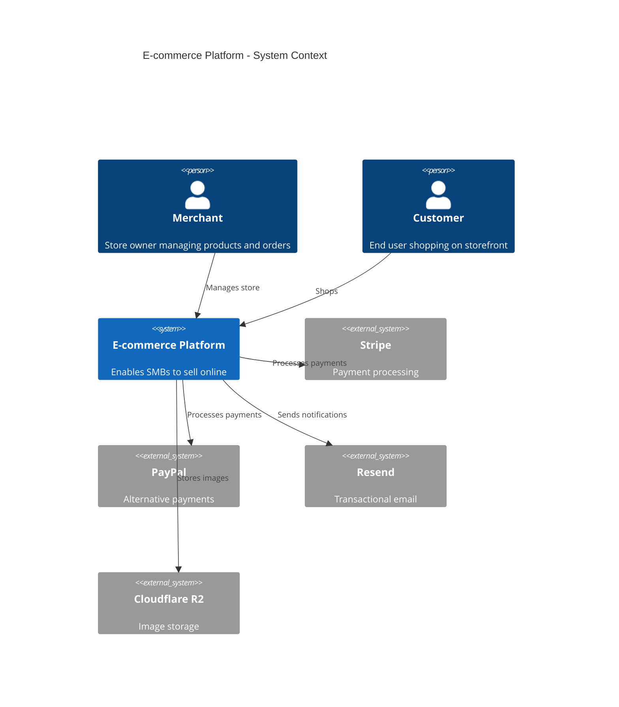
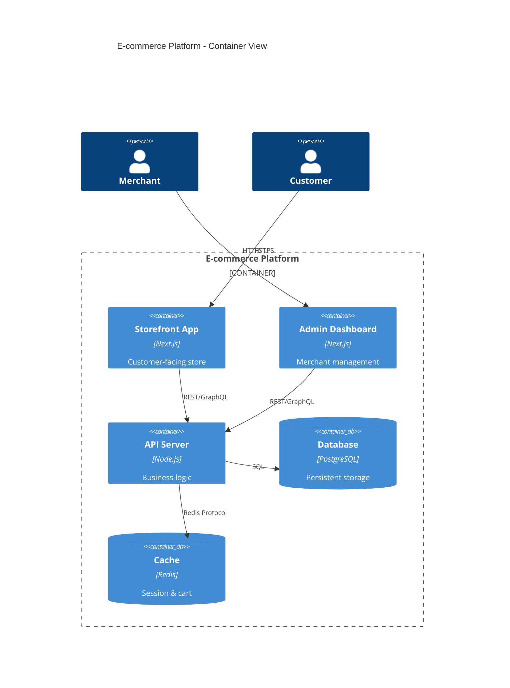
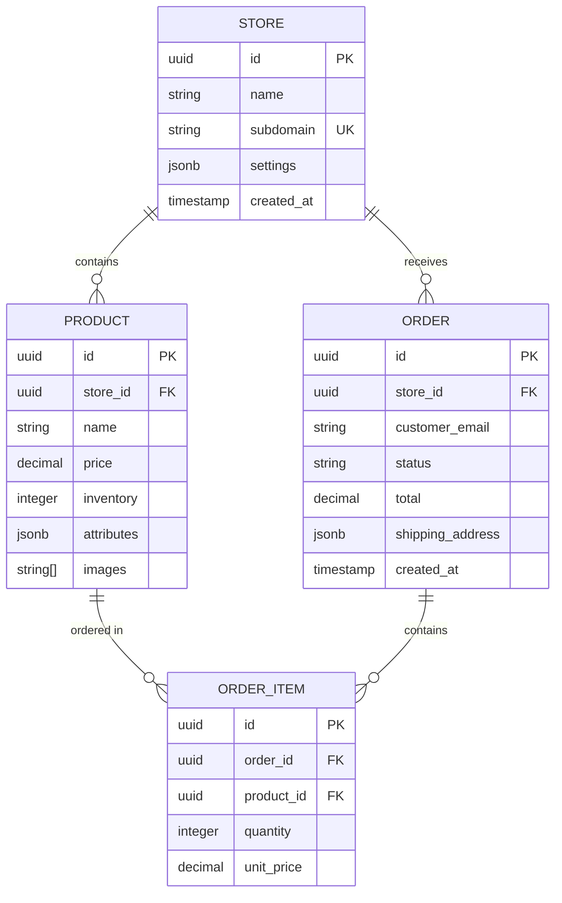
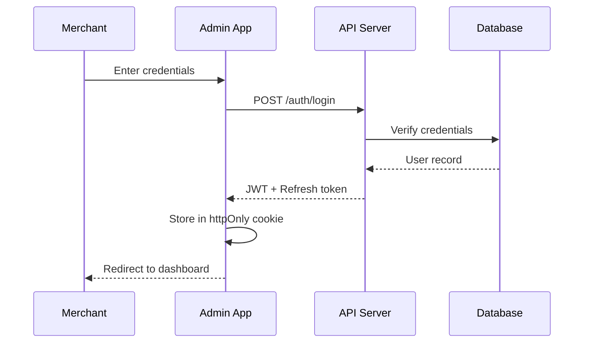

# Architecture Document — E-commerce Platform

## Executive Summary

A modern, cloud-native e-commerce platform built with Next.js and Node.js, utilizing serverless architecture for cost-effective scaling. The system prioritizes developer experience, security, and sub-2-second page loads.

## Technology Stack

### Runtime & Framework

| Layer | Technology | Version | Justification |
|-------|------------|---------|---------------|
| Frontend | Next.js | 14.x | SSR/SSG for SEO, React ecosystem, Vercel optimization |
| Backend | Node.js | 20 LTS | JavaScript consistency, npm ecosystem |
| Database | PostgreSQL | 16.x | ACID compliance, JSON support, cost-effective |
| Cache | Redis | 7.x | Session storage, cart caching, rate limiting |
| Search | Meilisearch | 1.x | Fast product search, typo tolerance |

### Infrastructure

| Component | Service | Rationale |
|-----------|---------|-----------|
| Hosting | Vercel | Optimized for Next.js, edge functions |
| Database | Supabase | Managed PostgreSQL, auth, realtime |
| File Storage | Cloudflare R2 | Cost-effective, S3-compatible |
| Email | Resend | Developer-friendly transactional email |
| Payments | Stripe + PayPal | Industry standards, wide adoption |

## System Architecture

### C4 Context Diagram

### C4 Container Diagram

## Data Model

### Entity Relationship Diagram

## API Design

### REST Endpoints

| Method | Endpoint | Description | Auth |
|--------|----------|-------------|------|
| POST | /api/stores | Create store | Owner |
| GET | /api/stores/:id | Get store | Public |
| POST | /api/products | Add product | Owner |
| GET | /api/products | List products | Public |
| POST | /api/orders | Create order | Customer |
| GET | /api/orders | List orders | Owner |
| POST | /api/payments/stripe/webhook | Stripe webhook | Webhook |

### Authentication Flow

## Security Considerations

> **Contribution by Jump Start: Security**
> 
> The following security measures are recommended based on OWASP Top 10 and PCI-DSS requirements:
> 
> 1. **Authentication:** Use bcrypt with cost factor 12 for password hashing
> 2. **Session Management:** JWT with 15-minute expiry, httpOnly secure cookies
> 3. **Input Validation:** Zod schemas for all API inputs
> 4. **CSRF Protection:** Double-submit cookie pattern
> 5. **Rate Limiting:** 100 requests/minute per IP, 10 failed logins trigger lockout
> 6. **Payment Security:** Never store card numbers; delegate to Stripe
> 7. **SQL Injection:** Use parameterized queries via Prisma ORM
> 8. **XSS Prevention:** React auto-escaping + CSP headers

### Threat Model Summary

| Threat | Mitigation | Status |
|--------|------------|--------|
| Credential stuffing | Rate limiting + CAPTCHA | Planned |
| Session hijacking | Secure cookies + rotation | Implemented |
| Payment fraud | Stripe Radar integration | Planned |
| Data breach | Encryption at rest | Implemented |

## Performance Considerations

> **Contribution by Jump Start: Performance**
> 
> Performance architecture recommendations:
> 
> 1. **Static Generation:** Pre-render product pages at build time (ISR)
> 2. **Image Optimization:** Next.js Image component with blur placeholders
> 3. **Database Indexing:** Composite indexes on (store_id, created_at) for orders
> 4. **Connection Pooling:** PgBouncer for database connections
> 5. **CDN Caching:** Vercel Edge for static assets
> 6. **Cart Caching:** Redis with 24-hour TTL for abandoned carts

### Performance Budget

| Metric | Target | Measurement |
|--------|--------|-------------|
| LCP | < 2.5s | Lighthouse |
| FID | < 100ms | Web Vitals |
| CLS | < 0.1 | Web Vitals |
| TTFB | < 200ms | Server logs |

## Phase Gate Approval

- [x] Technology stack justified with ADRs
- [x] Data model supports all PRD stories
- [x] API design covers all endpoints
- [x] Security reviewer approved (Jump Start: Security)
- [x] Performance plan documented

**Approved by:** Jo Otey  
**Date:** 2026-02-09
